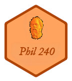

# Blah

This site is for sections of Phil 240 taught by Assistant Professor .

## Course Description

Surveys the major types of ethical theories, such as consequentialist, non-consequentialist, and virtue-based theories, and applies these to a number of contemporary moral controversies. These controversies include (but are not limited to) abortion, euthanasia, capital punishment, healthcare, sexual morality, professional and business ethics, and the environment. (PCS 1.1, 3 credit hours: 3 hours lecture, 0 hours lab)
