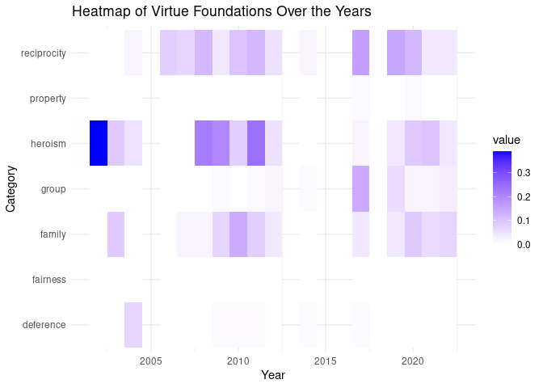

<a style="background-color: navy; color: white; padding: 7px 10px; "
   target="_blank" href="/slides/alternative-epistemologies.html">View
The Slides!</a>

# TSwift Mac-D

Other moral foundations theories look at other factors of morality such
as intuitions (Hopp et al. 2021). The *morality as cooperation*
foundations dictionary developed by Mark Alfano is a natural language
process that is intended to detect fundamental character traits in terms
of moral cooperation (For moral cooperation, see O. S. Curry 2016; O.
Curry, Chesters, and Van Lissa 2019).[1] Here, I analyze a set of music
lyrics by Taylor Swift using the morality as cooperation dictionary,
MAC-D, developed by Alfano, Cheong, and Curry (2022).

According to the ethical theory *morality as cooperation* (O. S. Curry
2016), humans over time have faced a number of problems necessitating
the need for cooperation (O. Curry, Chesters, and Van Lissa 2019). In
response to these needs, humans and other anthropoids evolved methods
for cooperation that act as solutions to these problems. As the theory
continues, across all societies, we can identify traits that evolved in
humans in light of these environmental needs (Shultz, Opie, and Atkinson
2011). The forms these evolved characteristics take are cooperative
behaviors that resemble character traits, strategies, dispositions,
behaviors, rules, norms, institutions, and technologies.

1.  family values

> Kin selection explains why we love and care for our families, why
> parents feel a duty of care to their offspring, why we feel a special
> obligation to help our extended families, and why we abhor incest
> (Hamilton, 1964; Lieberman, Tooby, & Cosmides, 2003).

1.  group loyalty

> Mutualism explains why we coordinate our activities to pursue projects
> of mutual interest, why we form groups, clubs, and coalitions (there
> is strength and safety in numbers), why we value these groups, their
> members, and our membership in them, why we adopt local norms and
> conventions, why we feel a special obligation to come to the aid of
> group members, and why we value loyalty, unity and solidarity (Lewis,
> 1969; Royce, 1908).

1.  reciprocity

> Social exchange explains why we seek opportunities for
> mutually-beneficial trade, and why we feel we ought to trust others,
> return favours (positive reciprocity), keep promises, pay debts,
> fulfil contracts, be grateful for favours received, feel guilty for
> favours not returned, avenge injuries (negative reciprocity), punish
> cheats, apologise for causing injuries, and forgive those who
> apologise (Cosmides & Tooby, 2005;Trivers, 1971).

1.  heroism
2.  defense

> Conflict resolution explains why we minimise the mutual costs of
> disputes by engaging in ritual contests: why we proudly display cues
> of power and high status (‘excellences’, including bravery and
> generosity); and, when bested, why we express humility, and respect,
> defer, and submit to our superiors (Curry, 2007; Sznycer et al.,
> 2017).

1.  fairness

> Conflict resolution also explains why we resolve disputes over
> divisible resources by dividing or sharing them (often resulting in
> equal shares), and hence why we feel an obligation to negotiate, seek
> a compromise, and be fair (Messick, 1993; Skyrms, 1996).

1.  property rights

> Conflict resolution also explains why we resolve disputes by
> recognising prior possession, hence why we feel we ought to respect
> others’ property and territory, and refrain from theft (Gintis, 2007).

The morality as cooperation view predicts that there will be the same
number of types of morality as there are of cooperation (O. Curry,
Chesters, and Van Lissa 2019). They test this hypothesis using a content
analysis of 600 ethnographic accounts of 60 societies chosen at random
from the electronic Human Relations Area Files (*eHRAF*). To test this
hypothesis, rather than using the hand code holographic method
(Otterbein 1978; Ember and Ember (2009)) used by O. Curry, Chesters, and
Van Lissa (2019), Alfano predicts that they can use natural language
processing, more specifically the Linguistic Inquiry and Word Count
method developed by James W. Pennebaker et al. (2015).[2] LIWC combs
through a text and counts the number of words belonging to a given
category. For instance, LIWC has been used to count the number of first
person pronouns, psychological processes such as positive and negative
emotions, and discreet emotions. It relies on a given dictionary
provided by the user which instructs the kinds of words to be counted.

Moral corpora is typically used by LIWC users to count moral terms using
the *Moral Foundations Dictionary* \[MFD\], for instance Hoover et all
use MFD to comb tweets for 5 domains and Padfield and Buchanan (2020)
use MFD to characterize the moral lean of US news organizations.
However, MFD is limited in a number of ways, not having foundations for
family values, reciprocity, heroism, or property rights. In addition,
there are interrater reliability issues. Given these issues, Alfano *et
al* created the *Morality as Cooperation Dictionary* (MAC-D).

First they brainstormed words aligning with the seven basic moral
principles hypothesized by Curry *et al*. These include loving your
family, being loyal to your group, returning favours, exercising courage
and generosity, showing deference to superiors, being fair in the
distribution of resources, and respecting property. They next used the
software program WordNet, which is a large English language lexical
database. When given a word or phase, Wordnet generates synsets that can
be used to search related terms according to a given category: synonyms,
hyponyms, antonyms, hypernyms, etc.

### eHRAF

eHRAF is an archive of thousands of full text ethnographies (Lagace
1979). Alfano *et al* also relied on these ethnographic accounts to test
the terms in MAC-D. To do so, they extracted 331 paragraphs from eHRAF
that were labeled as *ethics* resulting in 1,620,644 words from 9,653,
paragraphs, from 1,389 documents, covering 256 societies, 8 cultural
regions, following 9 subsistence strategies. They then used the MAC
dictionary to calculate the percentage of words from each paragraph that
was found in one or more of the seven foundation dictionaries.

## Building a Dataset

I have several datasets comprised of Taylor Swift song lyrics. One of
these is organized by year. A good question that is available to us
using this dataset, is whether there are computationally significant
differences between Swift’s earlier songs and more recent ones. One kind
of difference we can discern could be whether her moral commitments
changed according to the MAC-D. For instance, does she make more
references to family values in her earlier songs than she does her later
ones.

    ##   year
    ## 1 2002
    ## 2 2003
    ## 3 2004
    ## 4 2006
    ## 5 2007
    ## 6 2008
    ##                                                                                                                                                                                                                                                                                                                                                                                                                                                                                                                                                                                                                                                                                                                                                                                                                                                                                                                                                                                                                                                                                                                                                                                                                                                                                                                                                                                                                                                                                                                                                                                                                                                                                                                                                                                                                                                                                                                                                                                                                                                                                                                                                                                                                                                                                                                                                                                                                                                                                                                                                                                                                                                                                                                                                                                                                                                                                                                                                                                                                                                                                                                                                                                                                                                                                                                                                                                                                                                                                                                                                                                                                                                                                                                                                                                                                                                                                                                                                                                                                                                                                                                                                                                                                                                                                                                                                                                                                                                                                                                                                                                                                                                                                                                                                                                                                                                                                                                                                                                                                                                                                                                                                                                                                                                                                                                                                                                                                                                                                                                                                                                                                                                                                                                                                                                                                                                                                                                                                                                                                                                                                                                                                                                                                                                                                                                                                                                                                                                                                                                                                                                                                                                                                                                                                                                                                                                                                                                                                                                                                                                                                                                                                                                                                                                                                                                                                                                                                                                                                                                                                                                                                                                                                                                                                                                                                                                                                                                                                                                                                                                                                                                                                                                                                                                                                                                                                                                                                                                                                                                                                                                                                                                                                                                                                                                                                                                                                                                                                                                                                                                                                                                                                                                                                                                                                                                                                                                                                                                                                                                                                                                                                                                                                                                                                                                                                                                                                                                                                                                                                                                                                                                                                                                                                                                                                                                                                                                                                                                                                                                                                                                                                                                                                                                                                                                                                                                                                                                                                                                                                                                                                                                                                                                                                                                                                                                                                                                                                                                                                                                                                                                                                                                                                                                                                                                                                                                                                                                                                                                                                                                                                                                                                                                                                                                                                                                                                                                                                                                                                                                                                                                                                                                                                                                                                                                                                                                                                                                                                                                                                                                                                                                                                                                                                                                                                                                                                                                                                                                                                                                                                                                                                                                                                                                                                                                                                                                                                                                                                                                                                                                                                                                                                                                                                                                                                                                                                                                                                                                                                                                                                                                                                                                                                                                                                                                                                                                                                                                                                                                                                                                                                                                                                                                                                                                                                                                                                                                                                                                                                                                                                                                                                                                                                                                                                                                                                                                                                                                                                                                                                                                                                                                                                                                                                                                                                                                                                                                                                                                                                                                                                                                                                                                                                                                                                                                                                                                                                                                                                                                                                                                                                                                                                                                                                                                                                                                                                                                                                                                                                                                                                                                                                                                                                                                                                                                                                                                                                                                                                                                                                                                                                                                                                                                                                                                                                                                                                                                                                                                                                                                                                                                                                                                                                                                                                                                                                                                                                                                                                                                                                                                                                                                                                                                                                                                                                                                                                                                                                                                                                                                                                                                                                                                                                                                                                                                                                                                                                                                                                                                                                                                                                                                                                                                                                                                                                                                                                                                                                                                                                                                                                                                                                                                                                                                                                                                                                                                                                                                                                                                                                                                                                                                                                                                                                                                                                                                                                                                                                                                                                                                                                                                                                                                                                                                                                                                                                                                                                                                                                                                                                                                                                                                                                                                                                                                                                                                                                                                                                                                                                                                                                                                                                                                                                                                                                                                                                                                                                                                                                                                                                                                                                                                                                                                                                                                                                                                                                                                                                                                                                                                                                                                                                                                                                                                                                                                                                                                                                                                                                                                                                                                                                                                                                                                                                                                                                                                                                                                                                                                                                                                                                                                                                                                                                                                                                                                                                                                                                                                                                                                                                                                                                                                                                                                                                                                                                                                                                                                                                                                                                                                                                                                                                                                                                                                                                                                                                                                                                                                                                                                                                                                                                                                                                                                                                                                                                                                                                                                                                                                                                                                                                                                                                                                                                                                                                                                                                                                                                                                                                                                                                                                                                                                                                                                                                                                                                                                                                                                                                                                                                                                                                                                                                                                                                                                                                                                                                                                                                                                                                                                                                                                                                                                                                                                                                                                               lyrics
    ## 1                                                                                                                                                                                                                                                                                                                                                                                                                                                                                                                                                                                                                                                                                                                                                                                                                                                                                                                                                                                                                                                                                                                                                                                                                                                                                                                                                                                                                                                                                                                                                                                                                                                                                                                                                                                                                                                                                                                                                                                                                                                                                                                                                                                                                                                                                                                                                                                                                                                                                                                                                                                                                                                                                                                                                                                                                                                                                                                                                                                                                                                                                                                                                                                                                                                                                                                                                                                                                                                                                                                                                                                                                                                                                                                                                                                                                                                                                                                                                                                                                                                                                                                                                                                                                                                                                                                                                                                                                                                                                                                                                                                                                                                                                                                                                                                                                                                                                                                                                                                                                                                                                                                                                                                                                                                                                                                                                                                                                                                                                                                                                                                                                                                                                                                                                                                                                                                                                                                                                                                                                                                                                                                                                                                                                                                                                                                                                                                                                                                                                                                                                                                                                                                                                                                                                                                                                                                                                                                                                                                                                                                                                                                                                                                                                                                                                                                                                                                                                                                                                                                                                                                                                                                                                                                                                                                                                                                                                                                                                                                                                                                                                                                                                                                                                                                                                                                                                                                                                                                                                                                                                                                                                                                                                                                                                                                                                                                                                                                                                                                                                                                                                                                                                                                                                                                                                                                                                                                                                                                                                                                                                                                                                                                                                                                                                                                                                                                                                                                                                                                                                                                                                                                                                                                                                                                                                                                                                                                                                                                                                                                                                                                                                                                                                                                                                                                                                                                                                                                                                                                                                                                                                                                                                                                                                                                                                                                                                                                                                                                                                                                                                                                                                                                                                                                                                                                                                                                                                                                                                                                                                                                                                                                                                                                                                                                                                                                                                                                                                                                                                                                                                                                                                                                                                                                                                                                                                                                                                                                                                                                                                                                                                                                                                                                                                                                                                                                                                                                                                                                                                                                                                                                                                                                                                                                                                                                                                                                                                                                                                                                                                                                                                                                                                                                                                                                                                                                                                                                                                                                                                                                                                                                                                                                                                                                                                                                                                                                                                                                                                                                                                                                                                                                                                                                                                                                                                                                                                                                                                                                                                                                                                                                                                                                                                                                                                                                                                                                                                                                                                                                                                                                                                                                                                                                                                                                                                                                                                                                                                                                                                                                                                                                                                                                                                                                                                                                                                                                                                                                                                                                                                                                                                                                                                                                                                                                                                                                                                                                                                                                                                                                                                                                                                                                                                                                                                                                                                                                                                                                                                                                                                                                                                                                                                                                                                                                                                                                                                                                                                                                                                                                                                                                                                                                                                                                                                                                                                                                                                                                                                                                                                                                                                                                                                                                                                                                                                                                                                                                                                                                                                                                                                                                                                                                                                                                                                                                                                                                                                                                                                                                                                                                                                                                                                                                                                                                                                                                                                                                                                                                                                                                                                                                                                                                                                                                                                                                                                                                                                                                                                                                                                                                                                                                                                                                                                                                                                                                                                                                                                                                                                                                                                                                                                                                                                                                                                                                                                                                                                                                                                                                                                                                                                                                                                                                                                                                                                                                                                                                                                                                                                                                                                                                                                                                                                                                                                                                                                                                                                                                                                                                                                                                                                                                                                                                                                                                                                                                                                                                                                                                                                                                                                                                                                                                                                                                                                                                                                                                                                                                                                                                                                                                                                                                                                                                                                                                                                                                                                                                                                                                                                                                                                                                                  Smokey Black Nights Lyrics  Lets watch the tide chase the waves onto the sand I wonder if a broken heart can feel the warmth of my hand And I wonder what a piece of driftwood has seen all through his lifetime Lets walk away the past through the smokey black nights  Ive seen a million things Spoke a million words Now I only want to speak to you Waiting for the words Counting every bird Theres nothing Id rather do On the smokey black nights  Still through the haze I can make out constellations Ill make one of you and me as we sit in the sand And I saw that sunset gleaming as my eyes went wild Lets walk away the past through the smokey black nights  Ive played a thousand songs Sang a thousand words Now I only want to sing to you Waited on a wire Staring at the fire Theres nothing Id rather do On the smokey black nights  Ive walked a thousand miles Smiled a thousand smiles Now I only smile when Im with you Waiting for the words Counting every bird Theres nothing Id rather do On the smokey black nights  So walk with me as the sweet wind dances Ill write a song for you and me on the smokey black nights 1 Embed', 'Lucky You Lyrics  Theres a little girl in this little town With a little too much heart to go around Live forever, never say never You could do better, thats what she says  Mama named her Lucky on a starlit night A rabbit foot in her pocket, she dances in spite Of the fact that shes different And yet shes the same And she says, do-do-do-do-do-do-do-do Do-do-do-do-do-do-do, do-do-do-do Do-do-do, do-do-do, do-do-do-do Lucky you, lucky you  She sings her little song, she walks along A little pathway headed for the skies Left to travels, lives they unravel Mind over matter, thats what she says  Mama named her Lucky on a starlit night A rabbit foot in her pocket, she dances in spite Of the fact that shes different And yet shes the same And she says, do-do-do-do-do-do-do-do Do-do-do-do-do-do-do, do-do-do-do Do-do-do, do-do-do, do-do-do-do Lucky you, lucky you  Maybe shell sing you do-do-do-do Maybe shell bring you into the skies Honey shell love you, funny how some view Angels above you arent so far away  Mama named her Lucky on a starlit night A rabbit foot in her pocket, she dances in spite Of the fact that shes different And yet shes the same And she says, lucky you, lucky you Embed', 'American Boy Lyrics  American boy, living life as it goes Sitting on the fence posts Living in the lie American boy, living in the real world Trying just to get the girl Trying to survive  The simple things in life are always new Growing up on Sam Hill avenue Mama makes her cookies and daddys just The greatest living hero that ever was Nothing in the world can ever once destroy The hope of an American boy  Living off of bar tips, trying for relationships Looking for the love Suddenly rise, an American beauty Suddenly he cheats, sent from above  The simple things in life are always new Growing up on Sam Hill avenue Mama makes her cookies and daddys just The greatest living hero that ever was Nothing in the world can ever once destroy The hope of an American boy  American boy, raising little babies Hearing daddy maybe, Ill be like you Suddenly life, seems just like a new dawn Thats grown up, American boy  The simple things in life are always new Growing up on Grandview avenue Mama makes her cookies and daddys just The greatest living hero that ever was Nothing in the world will ever once destroy No, nothing in the world will ever once destroy The hope of an American boy 1 Embed
    ## 2                                                                                                                                                                                                                                                                                                                                                                                                                                                                                                                                                                                                                                                                                                                                                                                                                                                                                                                                                                                                                                                                                                                                                                                                                                                                                                                                                                                                                                                                                                                                                                                                                                                                                                                                                                                                                                                                                                                                                                                                                                                                                                                                                                                                                                                                                                                                                                                                                                                                                                                                                                                                                                                                                                                                                                                                                                                                                                                                                                                                                                                                                                                                                                                                                                                                                                                                                                                                                                                                                                                                                                                                                                                                                                                                                                                                                                                                                                                                                                                                                                                                                                                                                                                                                                                                                                                                                                                                                                                                                                                                                                                                                                                                                                                                                                                                                                                                                                                                                                                                                                                                                                                                                                                                                                                                                                                                                                                                                                                                                                                                                                                                                                                                                                                                                                                                                                                                                                                                                                                                                                                                                                                                                                                                                                                                                                                                                                                                                                                                                                                                                                                                                                                                                                                                                                                                                                                                                                               American Boy Lyrics  American boy, living life as it goes Sitting on the fence posts Living in the lie American boy, living in the real world Trying just to get the girl Trying to survive  The simple things in life are always new Growing up on Sam Hill avenue Mama makes her cookies and daddys just The greatest living hero that ever was Nothing in the world can ever once destroy The hope of an American boy  Living off of bar tips, trying for relationships Looking for the love Suddenly rise, an American beauty Suddenly he cheats, sent from above  The simple things in life are always new Growing up on Sam Hill avenue Mama makes her cookies and daddys just The greatest living hero that ever was Nothing in the world can ever once destroy The hope of an American boy  American boy, raising little babies Hearing daddy maybe, Ill be like you Suddenly life, seems just like a new dawn Thats grown up, American boy  The simple things in life are always new Growing up on Grandview avenue Mama makes her cookies and daddys just The greatest living hero that ever was Nothing in the world will ever once destroy No, nothing in the world will ever once destroy The hope of an American boy 1 Embed', 'Point of View Lyrics Time is passing slowly for the eight year old next door But mamas watch is ticking off the wall Jillian and Bobby think that theyre a perfect pair But girls could say hes just a bit too tall You dont have to do to win big You just have to think it Some folks say the glass is half full Others choose to drink it Some say the grass could be greener And the other side aint far away But I say the old could be newer And love still counts when it doesnt stay Some say I love you Some say love needs proof Its all in your point of view He hated pink so she threw out her favorite clothes His NFL was turned to TLC Babys got an attitude and thinks they just dont know But they all do and wish that she could see You dont have to do to win big You just have to think it Some folks say the glass is half full Others choose to drink it Some say the grass could be greener And the other side aint far away But I say the old could be newer And love still counts when it doesnt stay Some say I love you Some say love needs proof Its all in your point of view In the least or masterpiece Depends on ones opinion Worst of all they never call But dont think that they werent wishing Some say the grass could be greener And the other side aint far away But I say the old could be newer And love still counts when it doesnt stay Some say I love you Some say love needs proof Its all in your point of view Its all in your point of view Point of view Its all in your point of view Embed', 'Kid in the Crowd Lyrics I remember the eyes Of the kid in the crowd Who cut me down to size Realizing is crying out loud For every kid on stage Theres a kid in the crowd Embed', 'Brand New World Lyrics  Watch me go into the world today Watch me try to blow the past away Watch me laugh and watch me cry Watch me fall and watch me fly Cause Im living in a brand new world And you think Im just another girl But Im living just a day at a time And keeping it mine Someday Im gonna fly  Watch me catch a star and pin it down Watch me live another time around Watch me doubt the things I love Watch me find what Im proud of Cause Im living in a brand new world And you think Im just another girl But Im living just a day at a time And keeping it mine Someday Im gonna fly  And I may break my wings And fall flat on my shattered heart And I may hit the ground But I will never fall apart Cause Im living in a brand new world And you think Im just another girl But Im living just a day at a time And keeping it mine Im living in a brand new world And you think Im just another girl But Im living just a day at a time And keeping it mine Someday Im gonna fly 1 Embed', 'I Used to Fly Lyrics  ... I used to fly Didnt matter where Id been Cause Id seen the sky I wanna tell you why But somehow I know I Would break down and cry  I know you cant see me here But I am not alone Im lying here in invisible arms And I wont be alone tonight  You... you know I would die Before I let them see me See me cry Please dont leave tonight Oh let me down slowly Show me a light  I know you cant see me here But I am not alone Im lying here in invisible arms And I wont be alone tonight  Oh let me think Im strong Please dont bring me down I need you tonight  I know you cant see me here But I am not alone Im lying here in invisible arms And I wont be alone tonight  I... I used to fly Didnt matter where Id been Cause Id seen the sky Embed', 'Sugar Lyrics  What a thing to see What a thing to be What a perfect love, what a perfect home Cause every time she walks And every time she talks Is every time he knows what a perfect world hes living on  But whenever hes gone and when shes all alone His heart goes out to her on the telephone  And he says, Sugar, how I love you How I think about you all the time He calls her Sugar cause shes the sweetest thing Oh, shes the best thing hell ever find  With her midnight hair And with his favorite stare Shes a southern belle, hes a rockout king When she looks around Oh, she knows shes found Such a perfect life, such a perfect thing  And whenever hes gone and when shes all alone His heart goes out to her on the telephone  And he says, Sugar, how I love you How I think about you all the time He calls her Sugar cause shes the sweetest thing Oh, shes the best thing hell ever find  Oh, theres a reason for every season Theres a change within the range of every heart But the reason and the season Seem to be right so far  And he says, Sugar, how I love you How I think about you all the time He calls her Sugar cause shes the sweetest thing Oh, shes the best thing hell ever find He calls her Sugar 1 Embed', 'Tennessee Lyrics  Standing on a street somewhere I dont wanna be In a town thats made of stone Some bad directions must have me here by mistake Cause this sure aint what I call home  Let me close my eyes for a second See if I can get out of here, and  Let my hair hang down, and I can feel the golden sun And watch a pickup truck drive by And I wanna tell the world how good it is to be right here But I dont, I just sit under this tree And Im in Tennessee  Standing on a road leading to a barn With a cat named Eloise Later on, well all go fishing in the pond But all well catch is just a summer breeze  Let me close my eyes for a second See if I can stay right here, and  Let my hair hang down, and I can feel the golden sun And watch a pickup truck drive by And I wanna tell the world how good it is to be right here But I dont, I just sit under this tree And Im in Tennessee  When the pond is gone and Eloise floats away I find myself staring at the same old day I need to go back, back to where I feel so free Well, it looks like Im going back to Tennessee  I let my hair hang down, and I can feel the golden sun And watch a pickup truck drive by And I wanna tell the world how good it is to be right here But I dont, I just sit under this tree Just me and Eloise And Im in Tennessee Embed', 'In the Pouring Rain Lyrics I loved you for a little, a little while I think you know that! It would have worked for a little Except for that day you... Its not like you to be here When you said you wont! But in the pouring rain You changed everything You changed the tune! In the middle of the game You changed everything You changed the rules! Its not like we could forget something quickly Except in the pouring rain It kills me to say this It really does, it kills my heart! But I might still love you Reason were just fallen apart But its not like me to answer Gonna change my mind! But in the pouring rain, You changed everything You changed the tune! In the middle of the game You changed everything You changed the rules! And its not like we could forget something quickly Except in the pouring rain Oh, am I... All I torn myself I would be losing! But in the pouring rain, can you feel my pain? My tears are falling down from the sky! In the pouring rain, I can feel... I wonder who you love tonight Oh, in the pouring rain In the pouring rain Oh, in the pouring rain! In the pouring rain You changed everything You changed my mind Embed', 'Never Fade Lyrics  I think you fell off of your cloud today You didnt see it coming or did you You tried to please everybody But the sweet breeze swept you away  The sun goes down on a good day Tomorrow is still an unknown You think youre all alone in this place I think youre crazy cause I still love you baby  Oh dont fade away baby Blowing in the wind is getting harder to do Dont count the days as they leave you Count them as you find a day new Dont fade away Never fade  Hard to breathe, nobody knows its you Somebody blows your candle out You wore a mask, now thats broken too Everybody else was everything to you  The sun goes down on a good day Tomorrow is still an unknown You think everybody wants a fight I think youre crazy cause I still love you baby  Oh dont fade away baby Blowing in the wind is getting harder to do Dont count the days as they leave you Count them as you find a day new Dont fade away Never fade  I think you fell out of the sky today I think you know its true Youve seen the world, now all you see is me Tell me now baby what are you gonna do  Oh dont fade away baby Blowing in the wind is getting harder to do Dont count the days as they leave you Count them as you find a day new Dont fade away Dont fade away Dont fade away Never fade 1 Embed', 'Lucky You Lyrics  Theres a little girl in this little town With a little too much heart to go around Live forever, never say never You could do better, thats what she says  Mama named her Lucky on a starlit night A rabbit foot in her pocket, she dances in spite Of the fact that shes different And yet shes the same And she says, do-do-do-do-do-do-do-do Do-do-do-do-do-do-do, do-do-do-do Do-do-do, do-do-do, do-do-do-do Lucky you, lucky you  She sings her little song, she walks along A little pathway headed for the skies Left to travels, lives they unravel Mind over matter, thats what she says  Mama named her Lucky on a starlit night A rabbit foot in her pocket, she dances in spite Of the fact that shes different And yet shes the same And she says, do-do-do-do-do-do-do-do Do-do-do-do-do-do-do, do-do-do-do Do-do-do, do-do-do, do-do-do-do Lucky you, lucky you  Maybe shell sing you do-do-do-do Maybe shell bring you into the skies Honey shell love you, funny how some view Angels above you arent so far away  Mama named her Lucky on a starlit night A rabbit foot in her pocket, she dances in spite Of the fact that shes different And yet shes the same And she says, lucky you, lucky you Embed', 'Same Girl Lyrics Im still wearing my blue jeans No I dont know what you mean Im still the same girl Picking daisies in the field I believe in what I feel Ive always been the same girl Some moments change your life This could be one of them Im just living life and thinking Hey this could be fun Ive always been the same girl Living in the same world Singing little songs at the break of dawn girl Sitting on the front porch Do do do do do Watching what you say girl Never blow away girl Living in the crazy world Ive always been the same girl I still live in one small town But always love to move around Ive always been the same girl Still keep diaries that say Where I was and did that day Ive always been the same girl Some moments change your life This could be one of them Im just living life and thinking Hey this could be fun Ive always been the same girl Living in the same world Singing little songs at the break of dawn girl Sitting on the front porch Do do do do do Watching what you say girl Never blow away girl Living in the crazy world Ive always been the same girl Some days will change your life Yeah this could be one of them Im just living life and thinking... Ive always been the same girl Living in the same world Singing little songs at the break of dawn girl Sitting on the front porch Do do do do do Watching what you say girl Never blow away girl Living in the crazy world Ive always been the same girl Living in the crazy world Ive always been the same girl Embed', 'This Here Guitar Lyrics  Walking downtown shuffling my feet I try to dream my dreams above the concrete Store windows, traveled for miles But something I passed really caught my eye It was cracked down the middle, permanent scars But I fell in love with this here guitar  Nice to meet you, can I teach you All I know, can you show me what you do Where have you been What have you seen Who were you before you even knew me Have you been played for endless hours Or were you left in the corner Or were you someones best friend This here guitar  It was my baby, anyone could see I love the cracks, the curves, the hidden beauty But I cant help wondering why It came to me and where well say goodbye The cracks down the middle Cant see where they are Since I fell in love with this here guitar  Nice to meet you, can I teach you All I know, can you show me what you do Where have you been What have you seen Who were you before you even knew me Have you been played for endless hours Or were you left in the corner Or were you someones best friend This here guitar  Were you a present from a father to a son? Did he forget you Or just play you til you came undone? Hey, did some primadonna love you Til she got her fame and fortune? I wont do that to you  Nice to meet you, can I teach you All I know, can you show me what you do Where have you been? What have you seen? Who were you before you even knew me? Have you been played for endless hours Or were you left in the corner Or were you someones best friend? This here guitar Youre my guitar This here guitar 1 Embed', 'Mandolin Lyrics  Hes got a nice little life Hes gonna live it, but on Friday nights he plays that mandolin Painted red, and he said Its not the best I know But its mine, Im gonna make it mine People there cant help but care About the friendly music of a guy Whos getting by from their applause Hes got a song that moves along Hes got his local crowd tonight At Angelinas family bar and grill  Hes got his heart on his sleeve The songs he plays just living free But who knows what goes through his mind When he plays a song it brings along Everybody saying Whos that guy who plays the mandolin... mandolin Oh yeah, mandolin  Got a car, got a scar Like everyone hes got a few but Everybody loves that mandolin Got his problems, bills to pay Somehow that boy finds a way Through paychecks in tip jars, yeah  Hes got his heart on his sleeve The songs he plays just living free But who knows what goes through his mind When he plays a song it brings along Everybody saying Whos that guy who plays the mandolin... mandolin Oh yeah, mandolin  Oh hes the kind of guy Who never really wanted fame His feet are planted firmly on the ground He never wanted people to remember his name He never wanted word to get around That he found heaven on earth  Hes got his heart on his sleeve The songs he plays just living free But who knows what goes through his mind When he plays a song it brings along Everybody saying Whos that guy who plays the mandolin Oh, Im the guy who plays the mandolin Mandolin Oh, mandolin Embed', 'For You (4 U) Lyrics  It wouldve been nice to see you coming But that wouldve ruined the surprise It wouldve been nice to have a picture perfect world But then the truth would hurt my eyes It wouldve been good for you to be there And every time you always would Everything seems to have a picture perfect time And nothing seems to be a blur  Its hard to see a picture drop before it hits the ground Its nice to know youre here and youre helping me down But you were always there when I needed You would always see me clearly And you were never looking for a thank you Im saying one for you  Wouldve been cool to never fall down But then I never wouldve seen The power isnt with the picture perfect person You told me better things to come from in between  Its hard to see a picture drop before it hits the ground Its nice to know youre here and youre helping me down But you were always there when I needed You would always see me clearly And you were never looking for a thank you Im saying one, saying one, saying one for you  It wouldve been nice to see you coming But that wouldve ruined the surprise It wouldve been nice to have a picture perfect world But then the truth would hurt my eyes  But you were always there when I needed You would always see me clearly And you were never looking for a thank you Im saying one for you Embed', 'My Turn to Be Me Lyrics  Something about me didnt fit into your perfect world I bet the bluegrass stained your smile You should use a darker color when you write on the wall I havent read it a thousand times  Maybe if you saw me for a second you would realize Honey I was trying so hard  To talk, walk, think, stop Anytime you want me to Bend all my rules I used to let you choose Who you wanted me to be This time Im flying free Its my turn to be me  You liked the face but you had to replace me Inside I saw the walls of me go down You can take the girl away from Cowboy hats and steel guitars Shell still sing the same old songs  Maybe if you saw me for a second you would realize Honey I was trying so hard  To talk, walk, think, stop Anytime you want me to Bend all my rules I used to let you choose Who you wanted me to be This time Im flying free Its my turn to be me  Turned on that radio Hey thats when I realized It wasnt our song, it was yours And in conversation baby I was decoration Now I deserve a little bit more than  To talk, walk, think, stop Anytime you want me to Bend all my rules I used to let you choose Who you wanted me to be This time Im flying free Its my turn to be me Embed', 'Spinning Around Lyrics  Days go by, I wonder if you hear me Cant you read between the lines? Now Im standing still, I am disappearing Take this chance, Ill make you mine  Dont you wonder why You change in time Makes you feel so empty inside  But loves got me cornered in the back of the room Im spinning around, Im spinning around And all I see is someone I dont know Loves got me tangled, tired me too No sign of a wall, sign of wall Spinning me around And baby all I see is you  He tells lies, are you really thinking That you deserve another try When you see these eyes You see another planet Dont ask how, but fate decides  Dont you wonder why You change in time Makes you feel so empty inside  But loves got me cornered in the back of the room Im spinning around, Im spinning around And all I see is someone I dont know Loves got me tangled, tired me too No sign of a wall, sign of wall Spinning me around And baby all I see is you  Spinning and turning And living and learning I should be able to handle this Make it or break it Move it or shake it Do it or fake it Girl youve got to make it  But loves got me cornered in the back of the room Im spinning around, Im spinning around And all I see is someone I dont know Loves got me tangled, tired me too No sign of a wall, sign of wall Spinning me around And baby all I see is you  Spinning me around And baby all I see is you Spinning me around And all I see is you 2 Embed', 'Live for the Little Things Lyrics  One daybreak, one heartache Every once-upon-a-time That black dress, happiness Bubble baths and quarter lines  They mean so much to everyone But you count them up one by one  Clear midnights and this spotlight Once thinking that your dad was ten feet tall A blue bonnet, a braid on it Quiet winters and leaves that always fall Your black boots, my red flower ring Live for the little things  Oil paintings and making Every detail turn out bad One last stands, new romance Living for that love and person  They mean so much to everyone But you count them up one by one  Clear midnights and this spotlight Once thinking that your dad was ten feet tall A blue bonnet, a braid on it Quiet winters and leaves that always fall Your black boots, my red flower ring Live for the little things Ohh, yeah Ohh  No fighting, black riding Wish upon a star and give the moon a smile Pretending, defending Take a risk and go along for the ride Strawberries and fairies with wings Live for the little things  Na na na... Oh, yeah Na na na... Ohh, yeah Na na na... Embed', 'Honey Baby Lyrics  I think of you every single evening As I lay awake at night I try to think
    ## 3 Im Only Me When Im With You Lyrics  Friday night beneath the stars In a field behind your yard You and I are painting pictures in the sky And sometimes we dont say a thing Just listen to the crickets sing Everything I need is right here by my side  And I know everything about you I dont wanna live without you  Im only up when youre not down Dont wanna fly if youre still on the ground Its like no matter what I do Well you drive me crazy half the time The other half, Im only tryin to Let you know that what I feel is true And Im only me when Im with you  Just a small-town boy and girl Livin in a crazy world Tryna figure out what is and isnt true And I dont try to hide my tears My secrets or my deepest fears Through it all, nobody gets me like you do  And you know everything about me You say that you cant live without me  Im only up when youre not down Dont wanna fly if youre still on the ground Its like no matter what I do Well you drive me crazy half the time The other half, Im only tryin to Let you know that what I feel is true And Im only me when Im with you  When Im with anybody else Its so hard to be myself And only you can tell  That Im only up when youre not down Dont wanna fly if youre still on the ground Its like no matter what I do Well you drive me crazy half the time The other half, Im only tryin to Let you know that what I feel is true And Im only me Who I wanna be Well Im only me when Im with you  With you Uh-huh-huh, yeah 10 Embed', 'I Heart ? Lyrics  Wish I had concentrated They said love was complicated But its something I just fell into And it was overrated But just look what Ive created I came out alive but Im black and blue  Before you ask me if Im alright Think about what I had to do, yeah  Wake up and smell the breakup Fix my heart, put on my makeup Another mess I didnt plan And Ill bet you thought youd beat me Wish you could only see I got an I heart question mark Written on the back of my hand  Id be fine if you just walked by But you had to talk about why You were wrong and I was right But I cant believe you made me Sit at home, cry like a baby Wait right by the phone every night  And now you ask about you and I Theres no you and I Remember what you put me through, I had to  Wake up and smell the breakup Fix my heart, put on my makeup Another mess I didnt plan And Ill bet you thought youd beat me Wish you could only see I got an I heart question mark Written on the back of my hand  And when youre home all alone at night Youll still wonder why You took everything I had, oh, baby I havent thought about you and I Theres no you and I And I know someday you will  Wake up and smell the breakup Realize that we wont make up It didnt go the way you planned And youll know you didnt beat me When you look down and see I got an I heart question mark Written on the back of my hand  Written on the back of my hand An I heart question mark, yeah Written on the back of my hand 3 Embed', 'Welcome Distraction Lyrics  I got a little thing I call self control Cause I get a little crazy when I let too much go Loves a little messy, and you are too Right now, Im scared of both of you I laugh, and I play, and I wasnt gonna stray Swore Id never let a man in my way Youre the last thing I needed today  And I dont know Where I lost control And couldnt take it any longer Must have been somewhere between Your smile and the way you say my name I cant win, so I give in The more I fight, it just gets stronger Youre an inconvenient kind of satisfaction Welcome distraction, welcome distraction  Gone and spilled my coffee tryna get to the phone Cause it might be you, you just never know Cant talk to my friends without you coming up Its even kind of cute the way you cuss I wrote your name down a hundred thousand times Cause it looks so good right next to mine Youre the last thing I needed tonight  And I dont know Where I lost control And couldnt take it any longer Must have been somewhere between Your smile and the way you say my name I cant win, so I give in The more I fight, it just gets stronger Youre an inconvenient kind of satisfaction Welcome distraction  Im acting like a girl with nothing to lose When did I stop caring about anything but you?  And I dont know Where I lost control And couldnt take it any longer Must have been somewhere between Your smile and the way you say my name I cant win, so I give in The more I fight, it just gets stronger Youre an inconvenient kind of satisfaction  Welcome distraction, welcome distraction Welcome distraction, welcome distraction, oh, oh Embed', 'Sweet Tea and Gods Graces Lyrics  Tire swings, summer dreams, honeysuckle on the breeze Wilson County creek Laying in the green grass, I was watching clouds pass Baby, you were watching me Cold barns, truck beds, everything you said Slowly educating me I never had a lesson so sweet  You can get high on a first kiss You can get by with sweet tea and Gods graces You can love like a sinner and lose like a winner Nothings shatterproof You can crash and burn and come back someone new And thats what I learned from you  Autumn rain, window pane, looking how the leaves change Just like the two of us Still got your laugh, your ghost, your jacket Guess I loved you way too much But Im a little smarter, my hearts a little harder But its still soft enough to cry Cause I remember those times I remember  You can get high on a first kiss You can get by with sweet tea and Gods graces You can love like a sinner and lose like a winner Nothings shatterproof You can crash and burn and come back someone new And thats what I learned from you  Saw you just the other day All that I could think to say was Hey, how have you been? You caught me with that old smile Said, Its really been a while And I still think about back when  We used to get high on the first kiss We could get by with sweet tea and Jesus And you can love like a sinner and lose like a winner Nothings shatterproof You can crash and burn and now Im someone new And thats what I learned from you  Oh, thats what I learned from you Thats what I learned from you, oh you, oh Thats what I learned from you, oh yeah Embed', 'Your Face Lyrics  I heard a song tonight on the radio Another girl sings about a boy Just sees his face in every space in every room And I know that if I turn around you wont be there If I close my eyes will you be there?  I dont want to lose your face And I dont want to wake one day And not remember what time erased And I dont want to turn around Because Im not scared Of what love gave me and took away And I dont want to lose your face  Ive got a picture of you in my bedroom And I hope it never falls And I hope I never lose that feeling I used to get when you would call And now I wonder to myself Who were you and where are you? Were you ever here at all?  I dont want to lose your face And I dont want to wake one day And not remember what time erased And I dont want to turn around Because Im not scared Of what love gave me and took away And I dont want to lose your face  That girl in the song had it so good I wish I could close my eyes and see you I wish the sky had your face And the oceans had your eyes And the sunset had your lips And I had you  I dont want to lose your face And I dont want to wake one day And not remember what time erased And I dont want to turn around Because Im not scared Of what love gave me and took away And I dont want to lose your face 1 Embed', 'The Outside Lyrics  I didnt know what I would find When I went looking for a reason, I know I didnt read between the lines And, baby, Ive got nowhere to go  I tried to take the road less traveled by But nothing seems to work the first few times Am I right?  So how can I ever try to be better? Nobody ever lets me in I can still see you, this aint the best view On the outside looking in Ive been a lot of lonely places Ive never been on the outside  You saw me there, but never knew That I would give it all up to be A part of this, a part of you And now its all too late, so you see  You couldve helped if you had wanted to But no one notices until its too Late to do anything  How can I ever try to be better? Nobody ever lets me in I can still see you, this aint the best view On the outside looking in Ive been a lot of lonely places Ive never been on the outside  Oh, yeah  How can I ever try to be better? Nobody ever lets me in And I can still see you, this aint the best view On the outside looking in Ive been a lot of lonely places Ive never been on the outside  Oh-oh Oh, oh-oh Oh-oh Oh-oh 8 Embed', 'Cold as You Lyrics  You have a way of coming easily to me And when you take, you take the very best of me So I start a fight cause I need to feel something And you do what you want cause Im not what you wanted  Oh, what a shame, what a rainy ending given to a perfect day Just walk away, aint no use defending words that you will never say And now that Im sitting here thinking it through Ive never been anywhere cold as you  You put up walls and paint them all a shade of gray And I stood there loving you and wished them all away And you come away with a great little story Of a mess of a dreamer with the nerve to adore you  Oh, what a shame, what a rainy ending given to a perfect day So just walk away, aint no use defending words that you will never say And now that Im sitting here thinking it through Ive never been anywhere cold as you  You never did give a damn thing, honey, but I cried, cried for you And I know you wouldnt have told nobody if I died, died for you (Died for you)  Oh, what a shame, what a rainy ending given to a perfect day Every smile you fake is so condescending Counting all the scars you made And now that Im sitting here thinking it through Ive never been anywhere cold as you Ooh 16 Embed', 'What Do You Say Lyrics  What do you say, when you just know That hes the one, and you want to go fast But hes taking it slow? And what do you do, when hes next to you But hes a little bit shy? Well, heres something you can try  Hey, hey what do you say We go walking down the river all together? Its a warm May beautiful day And I feel like I could Talk to you forever With the sun shining bright It feels just like a day When everythings going to go just right I know it will be a sweet memory For you and me someday What do you say?  What do you see, when you look in his eyes? Theres something there That he cant disguise No matter how he tries And what do you feel, when you know its real? And you cant sit still If you dont own up, will you?  Hey, hey what do you say We go walking down the river all together? Its a warm May beautiful day And I feel like I could Talk to you forever With the sun shining bright It feels just like a day When everythings going to go just right I know it will be a sweet memory For you and me someday What do you say?  My imaginations running away Just dreaming about What I want you to say  Hey, hey what do you say We go walking down the river all together? Its a warm May beautiful day And I feel like I could Talk to you forever With the sun shining bright It feels just like a day When everythings going to go just right I know it will be a sweet memory For you and me someday What do you say? What do you say?  What do you say? What do you say? Embed', 'Need You Now Lyrics  I need you now Read letters that I wrote on the wall And the message that I left when I called I need you now Words I said drowned out by the rain Waiting there for you, but you never came My worlds a little colder now But Im keeping warm somehow  So here you are at my window Guess nobody told you I dont need you, dont need you And I waited, so frustrated Whos gonna hold you? I dont need you, dont need you now  I need you now Words I heard you whisper to me When we were walking down a one-way street And you need me now Thats what youve been telling my friends But Ive come too far to go back there again My heart, my mind, and numbers have changed You might as well forget my name  So here you are at my window Guess nobody told you I dont need you, dont need you And I waited, so frustrated Whos gonna hold you? I dont need you, dont need you now  I need you now Read letters that I wrote on the wall And the message that I left when I called  So here you are at my window Guess nobody told you I dont need you, dont need you And I waited, so frustrated So whos gonna hold you? I dont need you now  And I dont look for your car I dont wonder where you are I dont dream about you Cause I dont need you now I dont dream about the way That I never heard you say I need you, I need you I dont need you now  Dont need you I dont need you now 3 Embed', 'Teardrops On My Guitar Lyrics  Drew looks at me I fake a smile so he wont see That I want and Im needing Everything that we should be  Ill bet shes beautiful That girl he talks about And shes got everything that I have to live without  Drew talks to me I laugh cause its just so funny That I cant even see Anyone when hes with me  He says hes so in love Hes finally got it right I wonder if he knows hes all I think about at night  Hes the reason for the teardrops on my guitar The only thing that keeps me wishing on a wishing star Hes the song in the car I keep singing Dont know why I do  Drew walks by me Can he tell that I cant breathe? And there he goes, so perfectly The kind of flawless I wish I could be  Shed better hold him tight Give him all her love Look in those beautiful eyes and know shes lucky cause  Hes the reason for the teardrops on my guitar The only thing that keeps me wishing on a wishing star Hes the song in the car I keep singing Dont know why I do  So I drive home alone As I turn off the light Ill put his picture down and maybe get some sleep tonight  Cause hes the reason for the teardrops on my guitar The only one whos got enough for me to break my heart Hes the song in the car I keep singing Dont know why I do Hes the time taken up, but theres never enough And hes all that I need to fall into  Drew looks at me I fake a smile so he wont see 48 Embed', 'Angelina Lyrics  Angelinas got a pretty face And really long brown hair Lives somewhere in some wide open space Ive never been there I guess some people come around and purpose she But I dont cause  I have always been a bit reckless And I am not your typical princess Im fine just a bit of a mess And Im not perfect you could say I wasnt brought up that way Just watched Stephen run across the field Watched him catch the ball Hes got everything youd wanna be Hes funny, dark and tall Watch him run across to Angelina But I wont cause  I have always been a bit reckless And I am not your typical princess Im fine just a bit of a mess And Im not perfect you could say I wasnt brought up that way Stardom pushed across the line Tripped over my two feet hey oh yeah But aint it funny how It all comes out Isnt life sweet? I have always been a bit reckless And I am not your typical princess Im fine just a bit of a mess And Im not perfect you could say  I have always been a bit reckless And I am not your typical princess Im fine just a bit of a mess And Im not perfect you could say I wasnt brought up that way Embed', 'Tied Together with a Smile Lyrics  Seems the only one who doesnt see your beauty Is the face in the mirror looking back at you You walk around here thinking youre not pretty But thats not true Cause I know you  Hold on, baby, youre losing it The waters high, youre jumping into it and letting go And no one knows That you cry, but you dont tell anyone That you might not be the golden one And youre tied together with a smile But youre coming undone, oh  I guess its true that love was all you wanted Cause youre giving it away like its extra change Hoping it will end up in his pocket (Pocket) But he leaves you out like a penny in the rain Oh, cause its not his price to pay Its not his price to pay  Hold on, baby, youre losing it The waters high, youre jumping into it and letting go And no one knows That you cry, but you dont tell anyone That you might not be the golden one And youre tied together with a smile But youre coming undone, oh Oh, oh  Hold on, baby, youre losing it The waters high, youre jumping into it and letting go And no one knows That you cry but you dont tell anyone That you might not be the golden one And youre tied together with a smile But youre coming undone, oh  Youre tied together with a smile But youre coming undone, oh, oh-oh Goodbye, baby With a smile, baby, baby Oh 11 Embed', 'Picture to Burn Lyrics  State the obvious, I didnt get my perfect fantasy I realize you love yourself more than you could ever love me So go and tell your friends that Im obsessive and crazy Thats fine, you wont mind if I say By the way  I hate that stupid old pickup truck you never let me drive Youre a redneck heartbreak whos really bad at lying So watch me strike a match on all my wasted time As far as Im concerned, youre just another picture to burn  Theres no time for tears Im just sitting here planning my revenge Theres nothing stopping me From going out with all of your best friends And if you come around saying sorry to me My daddys gonna show you how sorry youll be  Cause I hate that stupid old pickup truck you never let me drive Youre a redneck heartbreak whos really bad at lying So watch me strike a match on all my wasted time As far as Im concerned, youre just another picture to burn  And if youre missing me, youd better keep it to yourself Cause coming back around here would be bad for your health  Cause I hate that stupid old pickup truck you never let me drive Youre a redneck heartbreak whos really bad at lying So watch me strike a match on all my wasted time In case you havent heard I really really hate that Stupid old pickup truck you never let me drive Youre a redneck heartbreak, whos really bad at lying So watch me strike a match on all my wasted time As far as Im concerned, youre just another picture to burn  Burn, burn, burn, baby, burn Youre just another picture to burn Baby, burn 31 Embed', 'Dark Blue Tennessee Lyrics  He said, I got me a nice new apartment In the city, wouldnt you have hated that? Im getting by with a broken heart you left me with He hangs up the phone and she whispers back  Missing you like this is such sweet sorrow Wont you come back to me? Ill be here, today and here tomorrow In dark blue Tennessee  He was lying when he said he moved to L.A Hes just hiding out on the other side of town With his head in his hands and shes just seven miles away Hes staring out the window and puts her picture down, saying  Missing you like this is such sweet sorrow Wont you come back to me? Ill be here, today and here tomorrow In dark blue Tennessee  She almost called him on the night that he wrote These simple words on his goodbye note  Missing you like this is such sweet sorrow Wont you come back to me? Ill be here, today and here tomorrow In dark blue Tennessee  In dark blue Tennessee 2 Embed', 'Who Ive Always Been Lyrics  You walk in here with your guitar man Your shiny boots and your full-on band A smile on your face, a knife in your hand Singing songs youve got memorized With whatever talent money buys So polished that it slips right through your hands  But dont worry yourself, I aint your competition Dont flatter yourself, that was never my intention  I want to talk about what you are that I aint Lets talk about what you do that I cant Lets talk about me and you And that empty room and who wins Lets talk about what you did to get here Lets talk about blood, and sweat, and tears Lets talk about what you want to be And who Ive always been  I walk in here with a beat-up case The same guitar Ive always played And the words I wrote down on a page When I was 12 years old and small town raised You tell the crowd youre paying dues I tell them, This is what I do And its what I put my life into As I breathe the smoke and cheap perfume  And say, life on musical road is rough conditions But the easy ride was never my ambition  I want to talk about what you are that I aint Lets talk about what you do that I cant Lets talk about me and you And that empty room and who wins Lets talk about what you did to get here Lets talk about blood, and sweat, and tears Lets talk about what you want to be And who Ive always been, oh  Lets talk about your childhood days You were the prom queen, I was on this stage So wheres that crown gotten you these days When its me and you and the same damn games?  So what have you got that I aint? And what do you do that I cant? Lets put me and you in an empty room And see who wins Lets talk about what you did to get here Lets talk about blood, and sweat, and tears Lets talk about who you want to be, girl And who Ive always been (Who Ive always been) 3 Embed', 'For You (4 U) Lyrics  It wouldve been nice to see you coming But that wouldve ruined the surprise It wouldve been nice to have a picture perfect world But then the truth would hurt my eyes It wouldve been good for you to be there And every time you always would Everything seems to have a picture perfect time And nothing seems to be a blur  Its hard to see a picture drop before it hits the ground Its nice to know youre here and youre helping me down But you were always there when I needed You would always see me clearly And you were never looking for a thank you Im saying one for you  Wouldve been cool to never fall down But then I never wouldve seen The power isnt with the picture perfect person You told me better things to come from in between  Its hard to see a picture drop before it hits the ground Its nice to know youre here and youre helping me down But you were always there when I needed You would always see me clearly And you were never looking for a thank you Im saying one, saying one, saying one for you  It wouldve been nice to see you coming But that wouldve ruined the surprise It wouldve been nice to have a picture perfect world But then the truth would hurt my eyes  But you were always there when I needed You would always see me clearly And you were never looking for a thank you Im saying one for you Embed', 'We Were Happy (Taylors Version)  Lyrics  We used to walk along the streets When the porch lights were shining bright Before I had somewhere to be Back when we had all night and we were happy I do recall a good while back,   we snuck into the circus You threw your arms around my neck, back when I deserved it And we were happy  When it was good, baby, it was good, baby We showed em all up No one could touch the way we laughed in the dark Talking bout your daddys farm we were gonna buy someday And we were happy  We used to watch the sun go down on the boats in the water Thats sorta how I feel right now And goodbyes so much harder cause we were happy  When it was good, baby, it was good, baby We showed em all up No one could touch the way we laughed in the dark Talking bout your daddys farm we were gonna buy someday And we were happy We were happy  Oh, I hate those voices telling me Im not in love anymore But they dont give me choices and thats what these tears are for Cause we were happy We were happy  When it was good, baby, it was good, baby We showed em all up No one could touch the way we laughed in the dark Talking bout your daddys farm And you were gonna marry me And we were happy We were happy Oh-oh-oh-oh We were happy 18 Embed', 'What To Wear Lyrics  Shes looking in the mirror The moments getting nearer She thinks about it as she walks her walk Up and down the staircase Make up fresh on her face She thinks about it as she talks her talk  School dance, first chance Always been a dreamer Theres one guy, shes shy Sees him through the mirror And everybody looks at her She thinks about it Blue dress, angel face Looking in the mirror Shoes, purse, hair tied back And you should see her Shes got her magic Floating through the air  Peace, love One thing leads into another Dream big, aim small Man you got to love her Shes got her hopes up Got them up to there Wondering what to wear  Shes standing in her bedroom Hell be pulling up soon She thinks about it when she sees headlights Looking out the window Shes got her diary to show That shes been waiting for this all her life First date, cant wait Looking in the mirror Heart all wrapped up Wait until he sees her Hes looking right at her She thinks about it Sixteen blue jeans, Abercrombie T-shirt Shoes, purse, hair tied back And you should see her Shes got her magic Floating through the air   The years went by The mirror saw her cry She got up again She got up again The wind blew by The small town lights She got up again Move out, find out Where the world can take her Bright lights, late nights Living for the greater Move to Paris Living on a prayer  Peace, love One thing leads into another Dream big, aim small Man you got to love her Shes got her hopes up Got them up to there Shes got her hopes up Got them up to there Wondering what to wear  Oh, oh, oh Wondering what to wear Embed', 'Never Mind Lyrics  Look at you, look at me Look at who we could be I want to know who you are What you want from the stars And every time I look at you, I can hardly say a thing My head starts to spin, and it hits me then I love you And every time you look at me, I could go crazy, but I dont Say it, but I wont Cause Id rather be alone than lose you  And all I really want to do is be next to you But Im too tired to fight And I could tell you now But baby, never mind  All the time, everyday Theres nothing I can do, baby, to make it go away So look at you, and look at me And think of who we could be But every time I look at you, I can hardly say a thing My head starts to spin, and it hits me then I love you And every time you look at me, I could go crazy, but I dont Say it, but I wont Cause Id rather be alone than lose you  And all I really want to do is be next to you But Im too tired to fight And I could tell you now But baby, never mind  All I really want to say is I need you, babe But how could you understand? What happens if you turn away And everything turns blue and gray? And I just wish I told you, never mind And I could tell you now, but baby, never mind  Yeah, oh yeah I could tell you now, but never mind Yeah, oh yeah, yeah And I could tell you now, but never mind 1 Embed', 'Beautiful Eyes Lyrics  Your beautiful eyes Stare right into mine And sometimes, I think of you late at night I dont know why  I wanna be somewhere where you are I wanna be where  Youre here, your eyes are lookin into mine So baby, make me fly My heart has never felt this way before Im looking through your-- Im looking through your eyes  I wake up, Im alive In only a little while, Ill cry Cause youre my lullaby So baby, come hold me tight cause I  I wanna be everything you need I wanna be where  Youre here, your eyes are lookin into mine So baby, make me fly My heart has never felt this way before Im looking through your-- Im looking through your eyes  Just as long as youre mine Ill be your everything now Let me love you, kiss you Oh, baby, let me miss you Let me see your, dream about, dream about Dream about your eyes  Ah, ah Beautiful eyes 1 Embed
    ## 4                                                                                                                                                                                                                                                                                                                                                                                                                                                                                                                                                                                                                                                                                                                                                                                                                                                                                                                                                                                                                                                                                                                                                                                                                                                                                                                                                                                                                                                                                                                                                                                                                                                                                                                                                                                                                                                                                                                                                                                                                                                                                                                                                                                                                                                                                                                                                                                                                                                                                                                                                                                                                                                                                                                                                                                                                                                                                                                                                                                                                                                                                                                                                                                                                                                                                                                                                                                                                                                                                                                                                                                                                                                                                                                                                                                                                                                                                                                                                                                                                                                                                                                                                                                                                                                                                                                                                            Im Only Me When Im With You Lyrics  Friday night beneath the stars In a field behind your yard You and I are painting pictures in the sky And sometimes we dont say a thing Just listen to the crickets sing Everything I need is right here by my side  And I know everything about you I dont wanna live without you  Im only up when youre not down Dont wanna fly if youre still on the ground Its like no matter what I do Well you drive me crazy half the time The other half, Im only tryin to Let you know that what I feel is true And Im only me when Im with you  Just a small-town boy and girl Livin in a crazy world Tryna figure out what is and isnt true And I dont try to hide my tears My secrets or my deepest fears Through it all, nobody gets me like you do  And you know everything about me You say that you cant live without me  Im only up when youre not down Dont wanna fly if youre still on the ground Its like no matter what I do Well you drive me crazy half the time The other half, Im only tryin to Let you know that what I feel is true And Im only me when Im with you  When Im with anybody else Its so hard to be myself And only you can tell  That Im only up when youre not down Dont wanna fly if youre still on the ground Its like no matter what I do Well you drive me crazy half the time The other half, Im only tryin to Let you know that what I feel is true And Im only me Who I wanna be Well Im only me when Im with you  With you Uh-huh-huh, yeah 10 Embed', 'The Outside Lyrics  I didnt know what I would find When I went looking for a reason, I know I didnt read between the lines And, baby, Ive got nowhere to go  I tried to take the road less traveled by But nothing seems to work the first few times Am I right?  So how can I ever try to be better? Nobody ever lets me in I can still see you, this aint the best view On the outside looking in Ive been a lot of lonely places Ive never been on the outside  You saw me there, but never knew That I would give it all up to be A part of this, a part of you And now its all too late, so you see  You couldve helped if you had wanted to But no one notices until its too Late to do anything  How can I ever try to be better? Nobody ever lets me in I can still see you, this aint the best view On the outside looking in Ive been a lot of lonely places Ive never been on the outside  Oh, yeah  How can I ever try to be better? Nobody ever lets me in And I can still see you, this aint the best view On the outside looking in Ive been a lot of lonely places Ive never been on the outside  Oh-oh Oh, oh-oh Oh-oh Oh-oh 8 Embed', 'Our Song Lyrics  I was ridin shotgun with my hair undone In the front seat of his car Hes got a one-hand feel on the steering wheel The other on my heart I look around, turn the radio down He says, Baby, is something wrong? I say, Nothin, I was just thinkin How we dont have a song And he says  Our song is the slamming screen door Sneakin out late, tapping on your window When were on the phone and you talk real slow Cause its late and your mama dont know Our song is the way you laugh The first date: Man, I didnt kiss her, and I should have And when I got home, fore I said amen Askin God if he could play it again  I was walking up the front porch steps After everything that day Had gone all wrong or been trampled on And lost and thrown away Got to the hallway, well on my way To my lovin bed I almost didnt notice all the roses And the note that said  Our song is the slamming screen door Sneakin out late, tapping on your window When were on the phone and you talk real slow Cause its late and your mama dont know Our song is the way you laugh The first date: Man, I didnt kiss her, and I should have And when I got home, fore I said amen Askin God if he could play it again  Da-da-da-da  Ive heard every album, listened to the radio Waited for somethin to come along That was as good as our song  Cause our song is the slamming screen door Sneakin out late, tappin on his window When were on the phone and he talks real slow Cause its late and his mama dont know Our song is the way he laughs The first date: Man, I didnt kiss him, and I should have And when I got home, fore I said amen Askin God if he could play it again  Play it again, oh, yeah Oh, oh, yeah  I was ridin shotgun with my hair undone In the front seat of his car I grabbed a pen and an old napkin And I wrote down our song 34 Embed', 'Shouldve Said No Lyrics  Its strange to think the songs we used to sing The smiles, the flowers, everything is gone Yesterday I found out about you Even now, just lookin at you feels wrong  You say that youd take it all back Given one chance It was a moment of weakness And you said yes  You shouldve said no, you shouldve gone home You shouldve thought twice fore you let it all go You shouldve known that word Bout what you did with herd get back to me (Get back to me) And I shouldve been there, in the back of your mind I shouldnt be asking myself why You shouldnt be begging for forgiveness at my feet You shouldve said no Baby, and you might still have me  You can see that Ive been cryin And baby, you know all the right things to say But do you honestly expect me to believe We could ever be the same?  You say that the past is the past You need one chance It was a moment of weakness And you said yes  You shouldve said no, you shouldve gone home You shouldve thought twice fore you let it all go You shouldve known that word Bout what you did with herd get back to me (Get back to me) And I shouldve been there, in the back of your mind I shouldnt be asking myself why You shouldnt be begging for forgiveness at my feet You shouldve said no Baby, and you might still have me Oh, oh  I cant resist Before you go, tell me this Was it worth it? Was she worth this? No, no No, no, no, no  You shouldve said no, you shouldve gone home You shouldve thought twice fore you let it all go You shouldve known that word Bout what you did with herd get back to me (Get back to me) And I shouldve been there, in the back of your mind I shouldnt be asking myself why You shouldnt be begging for forgiveness at my feet You shouldve said no Baby, and you might still have me 26 Embed', 'A Perfectly Good Heart Lyrics  Why would you wanna break A perfectly good heart? Why would you wanna take Our love and tear it all apart now? Why would you wanna make The very first scar? Why would you wanna break A perfectly good heart?  Maybe I shouldve seen the signs Shouldve read the writing on the wall And realized by the distance in your eyes That I would be the one to fall  No matter what you say I still cant believe that you would walk away It dont make sense to me, but  Why would you wanna break A perfectly good heart? Why would you wanna take Our love and tear it all apart now? Why would you wanna make The very first scar? Why would you wanna break A perfectly good heart?  Its not unbroken anymore (Its not unbroken anymore) How do I get it back the way it was before?  Why would you wanna break A perfectly good heart? Why would you wanna take Our love and tear it all apart now? Why would you wanna make The very first scar? Why would you wanna break-- (Why) Would you wanna break it?  Why would you wanna break A perfectly good heart? Why would you wanna take Our love and tear it all apart now? Why would you wanna make The very first scar? Why would you wanna break A perfectly good heart?  Mmm-hmm 4 Embed', 'Cold as You Lyrics  You have a way of coming easily to me And when you take, you take the very best of me So I start a fight cause I need to feel something And you do what you want cause Im not what you wanted  Oh, what a shame, what a rainy ending given to a perfect day Just walk away, aint no use defending words that you will never say And now that Im sitting here thinking it through Ive never been anywhere cold as you  You put up walls and paint them all a shade of gray And I stood there loving you and wished them all away And you come away with a great little story Of a mess of a dreamer with the nerve to adore you  Oh, what a shame, what a rainy ending given to a perfect day So just walk away, aint no use defending words that you will never say And now that Im sitting here thinking it through Ive never been anywhere cold as you  You never did give a damn thing, honey, but I cried, cried for you And I know you wouldnt have told nobody if I died, died for you (Died for you)  Oh, what a shame, what a rainy ending given to a perfect day Every smile you fake is so condescending Counting all the scars you made And now that Im sitting here thinking it through Ive never been anywhere cold as you Ooh 16 Embed', 'Tied Together with a Smile Lyrics  Seems the only one who doesnt see your beauty Is the face in the mirror looking back at you You walk around here thinking youre not pretty But thats not true Cause I know you  Hold on, baby, youre losing it The waters high, youre jumping into it and letting go And no one knows That you cry, but you dont tell anyone That you might not be the golden one And youre tied together with a smile But youre coming undone, oh  I guess its true that love was all you wanted Cause youre giving it away like its extra change Hoping it will end up in his pocket (Pocket) But he leaves you out like a penny in the rain Oh, cause its not his price to pay Its not his price to pay  Hold on, baby, youre losing it The waters high, youre jumping into it and letting go And no one knows That you cry, but you dont tell anyone That you might not be the golden one And youre tied together with a smile But youre coming undone, oh Oh, oh  Hold on, baby, youre losing it The waters high, youre jumping into it and letting go And no one knows That you cry but you dont tell anyone That you might not be the golden one And youre tied together with a smile But youre coming undone, oh  Youre tied together with a smile But youre coming undone, oh, oh-oh Goodbye, baby With a smile, baby, baby Oh 11 Embed', 'Tim McGraw Lyrics  He said the way my blue eyes shined Put those Georgia stars to shame that night I said, Thats a lie Just a boy in a Chevy truck That had a tendency of gettin stuck On backroads at night And I was right there beside him all summer long And then the time we woke up to find that summer gone  But when you think Tim McGraw I hope you think my favorite song The one we danced to all night long The moon like a spotlight on the lake When you think happiness I hope you think that little black dress Think of my head on your chest And my old faded blue jeans When you think Tim McGraw I hope you think of me  September saw a month of tears And thankin God that you werent here To see me like that But in a box beneath my bed Is a letter that you never read From three summers back Its hard not to find it all a little bittersweet And lookin back on all of that, its nice to believe  When you think Tim McGraw I hope you think my favorite song The one we danced to all night long The moon like a spotlight on the lake When you think happiness I hope you think that little black dress Think of my head on your chest And my old faded blue jeans When you think Tim McGraw I hope you think of me  And Im back for the first time since then Im standin on your street And theres a letter left on your doorstep And the first thing that youll read is: When you think Tim McGraw I hope you think my favorite song Someday youll turn your radio on I hope it takes you back to that place  When you think happiness I hope you think that little black dress Think of my head on your chest And my old faded blue jeans When you think Tim McGraw I hope you think of me Oh, think of me Mmmm  He said the way my blue eyes shine Put those Georgia stars to shame that night I said, Thats a lie 24 Embed', 'Invisible Lyrics  She cant see the way your eyes Light up when you smile Shell never notice how you stop and stare Whenever she walks by  And you cant see me wanting you the way you want her But you are everything to me  And I just wanna show you She dont even know you Shes never gonna love you like I want to And you just see right through me But if you only knew me We could be a beautiful miracle, unbelievable Instead of just invisible  Oh, yeah, oh  Theres a fire inside of you That cant help but shine through Shes never gonna see the light No matter what you do  And all I think about is how to make you think of me And everything that we could be  And I just wanna show you She dont even know you Shes never gonna love you like I want to And you just see right through me But if you only knew me We could be a beautiful miracle, unbelievable Instead of just invisible  Like shadows in a faded light Oh, were invisible I just wanna open your eyes And make you realize  I just wanna show you She dont even know you Baby, let me love you, let me want you You just see right through me But if you only knew me We could be a beautiful miracle, unbelievable Instead of just invisible  Oh, yeah  She cant see the way your eyes Light up when you smile 8 Embed', 'A Place In This World Lyrics  I dont know what I want, so dont ask me Cause Im still trying to figure it out Dont know whats down this road, Im just walking Trying to see through the rain coming down Even though Im not the only one Who feels the way I do  Im alone, on my own, and thats all I know Ill be strong, Ill be wrong, oh but life goes on Oh, Im just a girl, trying to find a place in this world  Got the radio on, my old blue jeans And Im wearing my heart on my sleeve Feeling lucky today, got the sunshine Could you tell me what more do I need And tomorrows just a mystery, oh yeah But thats okay  Im alone, on my own, and thats all I know Ill be strong, Ill be wrong, oh but life goes on Oh, Im just a girl, trying to find a place in this world  Maybe Im just a girl on a mission But Im ready to fly  Im alone, on my own, and thats all I know Ill be strong, Ill be wrong, oh but life goes on Oh Im alone, on my own, and thats all I know Oh Im just a girl, trying to find a place in this world  Oh Im just a girl Oh Im just a girl, oh, oh Oh Im just a girl 16 Embed', 'Marys Song (Oh My My My) Lyrics  She said I was seven and you were nine I looked at you like the stars that shined In the sky, the pretty lights And our daddies used to joke about the two of us Growing up and falling in love And our mamas smiled and rolled their eyes And said, Oh, my, my, my  Take me back to the house in the backyard tree Said youd beat me up, you were bigger than me You never did, you never did Take me back when our world was one block wide I dared you to kiss me and ran when you tried Just two kids, you and I Oh, my, my, my, my  Well, I was sixteen when suddenly I wasnt that little girl you used to see But your eyes still shined like pretty lights And our daddies used to joke about the two of us They never believed wed really fall in love And our mamas smiled and rolled their eyes And said, Oh, my, my, my  Take me back to the creek beds we turned up 2 a.m. riding in your truck And all I need is you next to me Take me back to the time we had our very first fight The slamming of doors stead of kissing goodnight You stayed outside til the morning light Oh, my, my, my, my  A few years had gone and come around We were sitting at our favorite spot in town And you looked at me, got down on one knee  Take me back to the time when we walked down the aisle Our whole town came and our mamas cried You said, I do, and I did too Take me home where we met so many years before Well rock our babies on that very front porch After all this time, you and I  Ill be eighty-seven, youll be eighty-nine Ill still look at you like the stars that shine In the sky, oh, my, my, my 14 Embed', 'Picture to Burn Lyrics  State the obvious, I didnt get my perfect fantasy I realize you love yourself more than you could ever love me So go and tell your friends that Im obsessive and crazy Thats fine, you wont mind if I say By the way  I hate that stupid old pickup truck you never let me drive Youre a redneck heartbreak whos really bad at lying So watch me strike a match on all my wasted time As far as Im concerned, youre just another picture to burn  Theres no time for tears Im just sitting here planning my revenge Theres nothing stopping me From going out with all of your best friends And if you come around saying sorry to me My daddys gonna show you how sorry youll be  Cause I hate that stupid old pickup truck you never let me drive Youre a redneck heartbreak whos really bad at lying So watch me strike a match on all my wasted time As far as Im concerned, youre just another picture to burn  And if youre missing me, youd better keep it to yourself Cause coming back around here would be bad for your health  Cause I hate that stupid old pickup truck you never let me drive Youre a redneck heartbreak whos really bad at lying So watch me strike a match on all my wasted time In case you havent heard I really really hate that Stupid old pickup truck you never let me drive Youre a redneck heartbreak, whos really bad at lying So watch me strike a match on all my wasted time As far as Im concerned, youre just another picture to burn  Burn, burn, burn, baby, burn Youre just another picture to burn Baby, burn 31 Embed', 'Teardrops on My Guitar (Pop Version) Lyrics  Drew looks at me I fake a smile so he wont see That I want and Im needing Everything that we should be  Ill bet shes beautiful That girl he talks about And shes got everything that I have to live without  Drew talks to me I laugh cause its just so funny That I cant even see Anyone when hes with me  He says hes so in love Hes finally got it right I wonder if he knows hes all I think about at night  Hes the reason for the teardrops on my guitar The only thing that keeps me wishing on a wishing star Hes the song in the car I keep singing Dont know why I do  Drew walks by me Can he tell that I cant breathe? And there he goes, so perfectly The kind of flawless I wish I could be  Shed better hold him tight Give him all her love Look in those beautiful eyes and know shes lucky cause  Hes the reason for the teardrops on my guitar The only thing that keeps me wishing on a wishing star Hes the song in the car I keep singing Dont know why I do  So I drive home alone As I turn off the light Ill put his picture down and maybe get some sleep tonight  Cause hes the reason for the teardrops on my guitar The only one whos got enough for me to break my heart Hes the song in the car I keep singing Dont know why I do (Why I do) Hes the time taken up, but theres never enough And hes all that I need to fall into  Drew looks at me I fake a smile so he wont see 3 Embed', 'Stay Beautiful Lyrics  Corys eyes are like a jungle He smiles, its like the radio He whispers songs into my window In words that nobody knows Theres pretty girls on every corner They watch him as hes walking home Saying, Does he know? Will you ever know?  Youre beautiful, every little piece, love Dont you know youre really gonna be someone? Ask anyone And when you find everything you looked for I hope your life leads you back to my door Oh, but if it dont Stay beautiful  Cory finds another way to be The highlight of my day Im taking pictures in my mind So I can save them for a rainy day Its hard to make a conversation When hes taking my breath away I should say, Hey, by the way  Youre beautiful, every little piece, love Dont you know youre really gonna be someone? Ask anyone And when you find everything you looked for I hope your life leads you back to my door Oh, but if it dont Stay beautiful  If you and I are a story That never gets told If what you are is a daydream Ill never get to hold, at least youll know  Youre beautiful, every little piece, love Dont you know youre really gonna be someone? Ask anyone And when you find everything you looked for I hope your life leads you back to my front door Oh, but if it dont Will you stay beautiful, beautiful, beautiful? Beautiful, beautiful, beautiful  La-la-la Oh-oh-oh Oh-oh-oh-oh Oh, but if it dont Stay beautiful, stay beautiful Na-na-na, na-na 18 Embed', 'I Heart ? Lyrics  Wish I had concentrated They said love was complicated But its something I just fell into And it was overrated But just look what Ive created I came out alive but Im black and blue  Before you ask me if Im alright Think about what I had to do, yeah  Wake up and smell the breakup Fix my heart, put on my makeup Another mess I didnt plan And Ill bet you thought youd beat me Wish you could only see I got an I heart question mark Written on the back of my hand  Id be fine if you just walked by But you had to talk about why You were wrong and I was right But I cant believe you made me Sit at home, cry like a baby Wait right by the phone every night  And now you ask about you and I Theres no you and I Remember what you put me through, I had to  Wake up and smell the breakup Fix my heart, put on my makeup Another mess I didnt plan And Ill bet you thought youd beat me Wish you could only see I got an I heart question mark Written on the back of my hand  And when youre home all alone at night Youll still wonder why You took everything I had, oh, baby I havent thought about you and I Theres no you and I And I know someday you will  Wake up and smell the breakup Realize that we wont make up It didnt go the way you planned And youll know you didnt beat me When you look down and see I got an I heart question mark Written on the back of my hand  Written on the back of my hand An I heart question mark, yeah Written on the back of my hand 3 Embed', 'Teardrops On My Guitar Lyrics  Drew looks at me I fake a smile so he wont see That I want and Im needing Everything that we should be  Ill bet shes beautiful That girl he talks about And shes got everything that I have to live without  Drew talks to me I laugh cause its just so funny That I cant even see Anyone when hes with me  He says hes so in love Hes finally got it right I wonder if he knows hes all I think about at night  Hes the reason for the teardrops on my guitar The only thing that keeps me wishing on a wishing star Hes the song in the car I keep singing Dont know why I do  Drew walks by me Can he tell that I cant breathe? And there he goes, so perfectly The kind of flawless I wish I could be  Shed better hold him tight Give him all her love Look in those beautiful eyes and know shes lucky cause  Hes the reason for the teardrops on my guitar The only thing that keeps me wishing on a wishing star Hes the song in the car I keep singing Dont know why I do  So I drive home alone As I turn off the light Ill put his picture down and maybe get some sleep tonight  Cause hes the reason for the teardrops on my guitar The only one whos got enough for me to break my heart Hes the song in the car I keep singing Dont know why I do Hes the time taken up, but theres never enough And hes all that I need to fall into  Drew looks at me I fake a smile so he wont see 48 Embed
    ## 5                                                                                                                                                                                                                                                                                                                                                                                                                                                                                                                                                                                                                                                                                                                                                                                                                                                                                                                                                                                                                                                                                                                                                                                                                                                                                                                                                                                                      Im Only Me When Im With You Lyrics  Friday night beneath the stars In a field behind your yard You and I are painting pictures in the sky And sometimes we dont say a thing Just listen to the crickets sing Everything I need is right here by my side  And I know everything about you I dont wanna live without you  Im only up when youre not down Dont wanna fly if youre still on the ground Its like no matter what I do Well you drive me crazy half the time The other half, Im only tryin to Let you know that what I feel is true And Im only me when Im with you  Just a small-town boy and girl Livin in a crazy world Tryna figure out what is and isnt true And I dont try to hide my tears My secrets or my deepest fears Through it all, nobody gets me like you do  And you know everything about me You say that you cant live without me  Im only up when youre not down Dont wanna fly if youre still on the ground Its like no matter what I do Well you drive me crazy half the time The other half, Im only tryin to Let you know that what I feel is true And Im only me when Im with you  When Im with anybody else Its so hard to be myself And only you can tell  That Im only up when youre not down Dont wanna fly if youre still on the ground Its like no matter what I do Well you drive me crazy half the time The other half, Im only tryin to Let you know that what I feel is true And Im only me Who I wanna be Well Im only me when Im with you  With you Uh-huh-huh, yeah 10 Embed', 'The Outside Lyrics  I didnt know what I would find When I went looking for a reason, I know I didnt read between the lines And, baby, Ive got nowhere to go  I tried to take the road less traveled by But nothing seems to work the first few times Am I right?  So how can I ever try to be better? Nobody ever lets me in I can still see you, this aint the best view On the outside looking in Ive been a lot of lonely places Ive never been on the outside  You saw me there, but never knew That I would give it all up to be A part of this, a part of you And now its all too late, so you see  You couldve helped if you had wanted to But no one notices until its too Late to do anything  How can I ever try to be better? Nobody ever lets me in I can still see you, this aint the best view On the outside looking in Ive been a lot of lonely places Ive never been on the outside  Oh, yeah  How can I ever try to be better? Nobody ever lets me in And I can still see you, this aint the best view On the outside looking in Ive been a lot of lonely places Ive never been on the outside  Oh-oh Oh, oh-oh Oh-oh Oh-oh 8 Embed', 'Our Song Lyrics  I was ridin shotgun with my hair undone In the front seat of his car Hes got a one-hand feel on the steering wheel The other on my heart I look around, turn the radio down He says, Baby, is something wrong? I say, Nothin, I was just thinkin How we dont have a song And he says  Our song is the slamming screen door Sneakin out late, tapping on your window When were on the phone and you talk real slow Cause its late and your mama dont know Our song is the way you laugh The first date: Man, I didnt kiss her, and I should have And when I got home, fore I said amen Askin God if he could play it again  I was walking up the front porch steps After everything that day Had gone all wrong or been trampled on And lost and thrown away Got to the hallway, well on my way To my lovin bed I almost didnt notice all the roses And the note that said  Our song is the slamming screen door Sneakin out late, tapping on your window When were on the phone and you talk real slow Cause its late and your mama dont know Our song is the way you laugh The first date: Man, I didnt kiss her, and I should have And when I got home, fore I said amen Askin God if he could play it again  Da-da-da-da  Ive heard every album, listened to the radio Waited for somethin to come along That was as good as our song  Cause our song is the slamming screen door Sneakin out late, tappin on his window When were on the phone and he talks real slow Cause its late and his mama dont know Our song is the way he laughs The first date: Man, I didnt kiss him, and I should have And when I got home, fore I said amen Askin God if he could play it again  Play it again, oh, yeah Oh, oh, yeah  I was ridin shotgun with my hair undone In the front seat of his car I grabbed a pen and an old napkin And I wrote down our song 34 Embed', 'Shouldve Said No Lyrics  Its strange to think the songs we used to sing The smiles, the flowers, everything is gone Yesterday I found out about you Even now, just lookin at you feels wrong  You say that youd take it all back Given one chance It was a moment of weakness And you said yes  You shouldve said no, you shouldve gone home You shouldve thought twice fore you let it all go You shouldve known that word Bout what you did with herd get back to me (Get back to me) And I shouldve been there, in the back of your mind I shouldnt be asking myself why You shouldnt be begging for forgiveness at my feet You shouldve said no Baby, and you might still have me  You can see that Ive been cryin And baby, you know all the right things to say But do you honestly expect me to believe We could ever be the same?  You say that the past is the past You need one chance It was a moment of weakness And you said yes  You shouldve said no, you shouldve gone home You shouldve thought twice fore you let it all go You shouldve known that word Bout what you did with herd get back to me (Get back to me) And I shouldve been there, in the back of your mind I shouldnt be asking myself why You shouldnt be begging for forgiveness at my feet You shouldve said no Baby, and you might still have me Oh, oh  I cant resist Before you go, tell me this Was it worth it? Was she worth this? No, no No, no, no, no  You shouldve said no, you shouldve gone home You shouldve thought twice fore you let it all go You shouldve known that word Bout what you did with herd get back to me (Get back to me) And I shouldve been there, in the back of your mind I shouldnt be asking myself why You shouldnt be begging for forgiveness at my feet You shouldve said no Baby, and you might still have me 26 Embed', 'A Perfectly Good Heart Lyrics  Why would you wanna break A perfectly good heart? Why would you wanna take Our love and tear it all apart now? Why would you wanna make The very first scar? Why would you wanna break A perfectly good heart?  Maybe I shouldve seen the signs Shouldve read the writing on the wall And realized by the distance in your eyes That I would be the one to fall  No matter what you say I still cant believe that you would walk away It dont make sense to me, but  Why would you wanna break A perfectly good heart? Why would you wanna take Our love and tear it all apart now? Why would you wanna make The very first scar? Why would you wanna break A perfectly good heart?  Its not unbroken anymore (Its not unbroken anymore) How do I get it back the way it was before?  Why would you wanna break A perfectly good heart? Why would you wanna take Our love and tear it all apart now? Why would you wanna make The very first scar? Why would you wanna break-- (Why) Would you wanna break it?  Why would you wanna break A perfectly good heart? Why would you wanna take Our love and tear it all apart now? Why would you wanna make The very first scar? Why would you wanna break A perfectly good heart?  Mmm-hmm 4 Embed', 'Cold as You Lyrics  You have a way of coming easily to me And when you take, you take the very best of me So I start a fight cause I need to feel something And you do what you want cause Im not what you wanted  Oh, what a shame, what a rainy ending given to a perfect day Just walk away, aint no use defending words that you will never say And now that Im sitting here thinking it through Ive never been anywhere cold as you  You put up walls and paint them all a shade of gray And I stood there loving you and wished them all away And you come away with a great little story Of a mess of a dreamer with the nerve to adore you  Oh, what a shame, what a rainy ending given to a perfect day So just walk away, aint no use defending words that you will never say And now that Im sitting here thinking it through Ive never been anywhere cold as you  You never did give a damn thing, honey, but I cried, cried for you And I know you wouldnt have told nobody if I died, died for you (Died for you)  Oh, what a shame, what a rainy ending given to a perfect day Every smile you fake is so condescending Counting all the scars you made And now that Im sitting here thinking it through Ive never been anywhere cold as you Ooh 16 Embed', 'Tied Together with a Smile Lyrics  Seems the only one who doesnt see your beauty Is the face in the mirror looking back at you You walk around here thinking youre not pretty But thats not true Cause I know you  Hold on, baby, youre losing it The waters high, youre jumping into it and letting go And no one knows That you cry, but you dont tell anyone That you might not be the golden one And youre tied together with a smile But youre coming undone, oh  I guess its true that love was all you wanted Cause youre giving it away like its extra change Hoping it will end up in his pocket (Pocket) But he leaves you out like a penny in the rain Oh, cause its not his price to pay Its not his price to pay  Hold on, baby, youre losing it The waters high, youre jumping into it and letting go And no one knows That you cry, but you dont tell anyone That you might not be the golden one And youre tied together with a smile But youre coming undone, oh Oh, oh  Hold on, baby, youre losing it The waters high, youre jumping into it and letting go And no one knows That you cry but you dont tell anyone That you might not be the golden one And youre tied together with a smile But youre coming undone, oh  Youre tied together with a smile But youre coming undone, oh, oh-oh Goodbye, baby With a smile, baby, baby Oh 11 Embed', 'Christmases When You Were Mine Lyrics  Please take down the mistletoe Cause I dont want to think about that right now Cause everything I want is miles away In a snow covered little town My mommas in the kitchen, worrying about me Seasons greetings, hope youre well Well Im doing alright If you were wondering Lately I can never tell  I know this shouldnt be a lonely time But there were Christmases when you were mine  Ive been doing fine without you, really Up until the nights got cold And everybodys here, except you, baby Seems like everyones got someone to hold  But for me its just a lonely time Cause there were Christmases when you were mine  Merry Christmas, everybody Thatll have to be something I just say this year Ill bet you got your mom another sweater And were your cousins late again? When you were putting up the lights this year Did you notice one less pair of hands?  I know this shouldnt be a lonely time But there were Christmases when I didnt wonder how you are tonight Cause there were Christmases when you were mine  You were mine 1 Embed', 'Invisible Lyrics  She cant see the way your eyes Light up when you smile Shell never notice how you stop and stare Whenever she walks by  And you cant see me wanting you the way you want her But you are everything to me  And I just wanna show you She dont even know you Shes never gonna love you like I want to And you just see right through me But if you only knew me We could be a beautiful miracle, unbelievable Instead of just invisible  Oh, yeah, oh  Theres a fire inside of you That cant help but shine through Shes never gonna see the light No matter what you do  And all I think about is how to make you think of me And everything that we could be  And I just wanna show you She dont even know you Shes never gonna love you like I want to And you just see right through me But if you only knew me We could be a beautiful miracle, unbelievable Instead of just invisible  Like shadows in a faded light Oh, were invisible I just wanna open your eyes And make you realize  I just wanna show you She dont even know you Baby, let me love you, let me want you You just see right through me But if you only knew me We could be a beautiful miracle, unbelievable Instead of just invisible  Oh, yeah  She cant see the way your eyes Light up when you smile 8 Embed', 'Tim McGraw Lyrics  He said the way my blue eyes shined Put those Georgia stars to shame that night I said, Thats a lie Just a boy in a Chevy truck That had a tendency of gettin stuck On backroads at night And I was right there beside him all summer long And then the time we woke up to find that summer gone  But when you think Tim McGraw I hope you think my favorite song The one we danced to all night long The moon like a spotlight on the lake When you think happiness I hope you think that little black dress Think of my head on your chest And my old faded blue jeans When you think Tim McGraw I hope you think of me  September saw a month of tears And thankin God that you werent here To see me like that But in a box beneath my bed Is a letter that you never read From three summers back Its hard not to find it all a little bittersweet And lookin back on all of that, its nice to believe  When you think Tim McGraw I hope you think my favorite song The one we danced to all night long The moon like a spotlight on the lake When you think happiness I hope you think that little black dress Think of my head on your chest And my old faded blue jeans When you think Tim McGraw I hope you think of me  And Im back for the first time since then Im standin on your street And theres a letter left on your doorstep And the first thing that youll read is: When you think Tim McGraw I hope you think my favorite song Someday youll turn your radio on I hope it takes you back to that place  When you think happiness I hope you think that little black dress Think of my head on your chest And my old faded blue jeans When you think Tim McGraw I hope you think of me Oh, think of me Mmmm  He said the way my blue eyes shine Put those Georgia stars to shame that night I said, Thats a lie 24 Embed', 'A Place In This World Lyrics  I dont know what I want, so dont ask me Cause Im still trying to figure it out Dont know whats down this road, Im just walking Trying to see through the rain coming down Even though Im not the only one Who feels the way I do  Im alone, on my own, and thats all I know Ill be strong, Ill be wrong, oh but life goes on Oh, Im just a girl, trying to find a place in this world  Got the radio on, my old blue jeans And Im wearing my heart on my sleeve Feeling lucky today, got the sunshine Could you tell me what more do I need And tomorrows just a mystery, oh yeah But thats okay  Im alone, on my own, and thats all I know Ill be strong, Ill be wrong, oh but life goes on Oh, Im just a girl, trying to find a place in this world  Maybe Im just a girl on a mission But Im ready to fly  Im alone, on my own, and thats all I know Ill be strong, Ill be wrong, oh but life goes on Oh Im alone, on my own, and thats all I know Oh Im just a girl, trying to find a place in this world  Oh Im just a girl Oh Im just a girl, oh, oh Oh Im just a girl 16 Embed', 'Marys Song (Oh My My My) Lyrics  She said I was seven and you were nine I looked at you like the stars that shined In the sky, the pretty lights And our daddies used to joke about the two of us Growing up and falling in love And our mamas smiled and rolled their eyes And said, Oh, my, my, my  Take me back to the house in the backyard tree Said youd beat me up, you were bigger than me You never did, you never did Take me back when our world was one block wide I dared you to kiss me and ran when you tried Just two kids, you and I Oh, my, my, my, my  Well, I was sixteen when suddenly I wasnt that little girl you used to see But your eyes still shined like pretty lights And our daddies used to joke about the two of us They never believed wed really fall in love And our mamas smiled and rolled their eyes And said, Oh, my, my, my  Take me back to the creek beds we turned up 2 a.m. riding in your truck And all I need is you next to me Take me back to the time we had our very first fight The slamming of doors stead of kissing goodnight You stayed outside til the morning light Oh, my, my, my, my  A few years had gone and come around We were sitting at our favorite spot in town And you looked at me, got down on one knee  Take me back to the time when we walked down the aisle Our whole town came and our mamas cried You said, I do, and I did too Take me home where we met so many years before Well rock our babies on that very front porch After all this time, you and I  Ill be eighty-seven, youll be eighty-nine Ill still look at you like the stars that shine In the sky, oh, my, my, my 14 Embed', 'Picture to Burn Lyrics  State the obvious, I didnt get my perfect fantasy I realize you love yourself more than you could ever love me So go and tell your friends that Im obsessive and crazy Thats fine, you wont mind if I say By the way  I hate that stupid old pickup truck you never let me drive Youre a redneck heartbreak whos really bad at lying So watch me strike a match on all my wasted time As far as Im concerned, youre just another picture to burn  Theres no time for tears Im just sitting here planning my revenge Theres nothing stopping me From going out with all of your best friends And if you come around saying sorry to me My daddys gonna show you how sorry youll be  Cause I hate that stupid old pickup truck you never let me drive Youre a redneck heartbreak whos really bad at lying So watch me strike a match on all my wasted time As far as Im concerned, youre just another picture to burn  And if youre missing me, youd better keep it to yourself Cause coming back around here would be bad for your health  Cause I hate that stupid old pickup truck you never let me drive Youre a redneck heartbreak whos really bad at lying So watch me strike a match on all my wasted time In case you havent heard I really really hate that Stupid old pickup truck you never let me drive Youre a redneck heartbreak, whos really bad at lying So watch me strike a match on all my wasted time As far as Im concerned, youre just another picture to burn  Burn, burn, burn, baby, burn Youre just another picture to burn Baby, burn 31 Embed', 'Teardrops On My Guitar (Cahill Radio Edit) Lyrics  Drew looks at me I fake a smile so he wont see That I want and Im needing Everything that we should be  Ill bet shes beautiful, that girl he talks about And shes got everything that I have to live without  Drew talks to me I laugh cause its just so funny That I cant even see Anyone when hes with me  He says hes so in love, hes finally got it right I wonder if he knows hes all I think about at night  Hes the reason for the teardrops on my guitar The only thing that keeps me wishing on a wishing star Hes the song in the car I keep singing, dont know why I do...  Drew walks by me Cant he tell that I cant breathe? And there he goes, so perfectly The kind of flawless I wish I could be  Shed better hold him tight, give him all her love Look in those beautiful eyes and know shes lucky cause  Hes the reason for the teardrops on my guitar The only thing that keeps me wishing on a wishing star Hes the song in the car I keep singing, dont know why I do... Hes the reason for the teardrops on my guitar The only thing that keeps me wishing on a wishing star Hes the song in the car I keep singing, dont know why I do...  So I drive home alone, as I turn off the light Ill put his picture down and maybe get some sleep tonight  Hes the reason for the teardrops on my guitar The only one whos got enough of me to break my heart Hes the song in the car I keep singing, dont know why I do...  Hes the time taken up, but theres never enough And hes all that I need to fall into Drew looks at me I fake a smile so he wont see Embed', 'Teardrops On My Guitar (Acoustic) Lyrics  Drew looks at me I fake a smile so he wont see That I want and Im needing Everything that we should be  Ill bet shes beautiful That girl he talks about And shes got everything that I have to live without  Drew talks to me I laugh cause its just so funny That I cant even see Anyone when hes with me  He says hes so in love Hes finally got it right I wonder if he knows hes all I think about at night  Hes the reason for the teardrops on my guitar The only thing that keeps me wishing on a wishing star Hes the song in the car I keep singing Dont know why I do  Drew walks by me Can he tell that I cant breathe? And there he goes, so perfectly The kind of flawless I wish I could be  Shed better hold him tight Give him all her love Look in those beautiful eyes and know shes lucky cause  Hes the reason for the teardrops on my guitar The only thing that keeps me wishing on a wishing star Hes the song in the car I keep singing Dont know why I do  So I drive home alone As I turn off the light Ill put his picture down and maybe get some sleep tonight  Cause hes the reason for the teardrops on my guitar The only one whos got enough for me to break my heart Hes the song in the car I keep singing Dont know why I do Hes the time taken up, but theres never enough And hes all that I need to fall into  Drew looks at me I fake a smile so he wont see Embed', 'Stay Beautiful Lyrics  Corys eyes are like a jungle He smiles, its like the radio He whispers songs into my window In words that nobody knows Theres pretty girls on every corner They watch him as hes walking home Saying, Does he know? Will you ever know?  Youre beautiful, every little piece, love Dont you know youre really gonna be someone? Ask anyone And when you find everything you looked for I hope your life leads you back to my door Oh, but if it dont Stay beautiful  Cory finds another way to be The highlight of my day Im taking pictures in my mind So I can save them for a rainy day Its hard to make a conversation When hes taking my breath away I should say, Hey, by the way  Youre beautiful, every little piece, love Dont you know youre really gonna be someone? Ask anyone And when you find everything you looked for I hope your life leads you back to my door Oh, but if it dont Stay beautiful  If you and I are a story That never gets told If what you are is a daydream Ill never get to hold, at least youll know  Youre beautiful, every little piece, love Dont you know youre really gonna be someone? Ask anyone And when you find everything you looked for I hope your life leads you back to my front door Oh, but if it dont Will you stay beautiful, beautiful, beautiful? Beautiful, beautiful, beautiful  La-la-la Oh-oh-oh Oh-oh-oh-oh Oh, but if it dont Stay beautiful, stay beautiful Na-na-na, na-na 18 Embed', 'Christmas Must Be Something More Lyrics  What if ribbons and bows didnt mean a thing? Would the song still survive without five golden rings? Would you still wanna kiss without mistletoe? What would happen if God never let it snow? What would happen if Christmas carols told a lie? Tell me, what would you find?  Youd see that today holds something special Something holy, not superficial So heres to the birthday boy who saved our lives Its something we all try to ignore And put a wreath up on your door So heres something you should know that is for sure Christmas must be something more  What if angels did not pay attention to All the things that we wished they would always do? What if happiness came in a cardboard box? Then I think there is something we all forgot What would happen if presents all went away? Tell me, what would you find?  Youd see that today holds something special Something holy, not superficial So heres to the birthday boy who saved our lives Its something we all try to ignore And put a wreath up on your door So heres something you should know that is for sure Christmas must be something more  We get so caught up in all of it Business and relationships Hundred-mile-an-hour lives And its this time of year And everybodys here It seems the last thing on your mind  Is that the day holds something special Something holy, not superficial So heres to Jesus Christ who saved our lives Its something we all try to ignore And put a wreath up on your door But heres something you should know that is for sure Christmas must be something Christmas must be something Christmas must be something more  Theres gotta be more Theres gotta be more 1 Embed', 'Teardrops On My Guitar Lyrics  Drew looks at me I fake a smile so he wont see That I want and Im needing Everything that we should be  Ill bet shes beautiful That girl he talks about And shes got everything that I have to live without  Drew talks to me I laugh cause its just so funny That I cant even see Anyone when hes with me  He says hes so in love Hes finally got it right I wonder if he knows hes all I think about at night  Hes the reason for the teardrops on my guitar The only thing that keeps me wishing on a wishing star Hes the song in the car I keep singing Dont know why I do  Drew walks by me Can he tell that I cant breathe? And there he goes, so perfectly The kind of flawless I wish I could be  Shed better hold him tight Give him all her love Look in those beautiful eyes and know shes lucky cause  Hes the reason for the teardrops on my guitar The only thing that keeps me wishing on a wishing star Hes the song in the car I keep singing Dont know why I do  So I drive home alone As I turn off the light Ill put his picture down and maybe get some sleep tonight  Cause hes the reason for the teardrops on my guitar The only one whos got enough for me to break my heart Hes the song in the car I keep singing Dont know why I do Hes the time taken up, but theres never enough And hes all that I need to fall into  Drew looks at me I fake a smile so he wont see 48 Embed
    ## 6                                                                                                                                                                                                                                                                                                                                                                                                                                                                                                                                                                                                                                                                                                                                                                                                                                                                                                                                                                                                                                                                                                                                                                                                                                                                                                                                                                                                                                                                                                                                                                                                                                                                                                                                                                                                                                                                                                                                                                                                                                                                                                                                                                                                                                                                                                                                                                                                                                                                                                                                                                                                                                                                                                                                                                                                                                                                                                                                                                                                                                                                                                                                                                                                                                                                                                                                                                                                                                                                                                                                                                                                                                                                                                                                                                                                                                                                                                                                                                                                                                                                                                                                                                                                                                                                                                                                                                                                                                                                                                                                                                                                                                                                                                                                                                    Im Only Me When Im With You Lyrics  Friday night beneath the stars In a field behind your yard You and I are painting pictures in the sky And sometimes we dont say a thing Just listen to the crickets sing Everything I need is right here by my side  And I know everything about you I dont wanna live without you  Im only up when youre not down Dont wanna fly if youre still on the ground Its like no matter what I do Well you drive me crazy half the time The other half, Im only tryin to Let you know that what I feel is true And Im only me when Im with you  Just a small-town boy and girl Livin in a crazy world Tryna figure out what is and isnt true And I dont try to hide my tears My secrets or my deepest fears Through it all, nobody gets me like you do  And you know everything about me You say that you cant live without me  Im only up when youre not down Dont wanna fly if youre still on the ground Its like no matter what I do Well you drive me crazy half the time The other half, Im only tryin to Let you know that what I feel is true And Im only me when Im with you  When Im with anybody else Its so hard to be myself And only you can tell  That Im only up when youre not down Dont wanna fly if youre still on the ground Its like no matter what I do Well you drive me crazy half the time The other half, Im only tryin to Let you know that what I feel is true And Im only me Who I wanna be Well Im only me when Im with you  With you Uh-huh-huh, yeah 10 Embed', 'You Belong with Me Lyrics  Youre on the phone with your girlfriend, shes upset Shes going off about something that you said Cause she doesnt get your humor like I do Im in the room, its a typical Tuesday night Im listening to the kind of music she doesnt like And shell never know your story like I do  But she wears short skirts, I wear T-shirts Shes Cheer Captain and Im on the bleachers Dreaming about the day when you wake up and find That what youre looking for has been here the whole time  If you could see that Im the one who understands you Been here all along, so why cant you see? You belong with me, you belong with me  Walking the streets with you and your worn-out jeans I cant help thinking this is how it ought to be Laughing on a park bench, thinking to myself Hey, isnt this easy? And youve got a smile that could light up this whole town I havent seen it in a while since she brought you down You say youre fine, I know you better than that Hey, whatcha doing with a girl like that?  She wears high heels, I wear sneakers Shes Cheer Captain and Im on the bleachers Dreaming about the day when you wake up and find That what youre looking for has been here the whole time  If you could see that Im the one who understands you Been here all along, so why cant you see? You belong with me Standing by and waiting at your back door All this time how could you not know, baby? You belong with me, you belong with me  Oh, I remember you driving to my house In the middle of the night Im the one who makes you laugh When you know youre bout to cry And I know your favorite songs And you tell me bout your dreams Think I know where you belong Think I know its with me  Cant you see that Im the one who understands you Been here all along, so why cant you see? You belong with me Standing by and waiting at your back door All this time how could you not know, baby? You belong with me, you belong with me  You belong with me Have you ever thought just maybe You belong with me? You belong with me 94 Embed', 'Teardrops on my Guitar (Live from Clear Channel Stripped 2008) Lyrics  Drew looks at me I fake a smile so he wont see That I want and Im needing Everything that we should be  Ill bet shes beautiful, that girl he talks about And shes got everything that I have to live without  Drew talks to me I laugh cause its so damn funny That I cant even see Anyone when hes with me  He says hes so in love, hes finally got it right I wonder if he knows hes all I think about at night  Hes the reason for the teardrops on my guitar The only thing that keeps me wishing on a wishing star Hes the song in the car I keep singing, dont know why I do...  Drew walks by me Cant he tell that I cant breathe? And there he goes, so perfectly The kind of flawless I wish I could be  Shed better hold him tight, give him all her love Look in those beautiful eyes and know shes lucky cause  Hes the reason for the teardrops on my guitar The only thing that keeps me wishing on a wishing star Hes the song in the car I keep singing, dont know why I do...  So I drive home alone, as I turn off the light Ill put his picture down and maybe get some sleep tonight  Hes the reason for the teardrops on my guitar The only one whos got enough of me to break my heart Hes the song in the car I keep singing, dont know why I do...  Hes the time taken up, but theres never enough And hes all that I need to fall into Drew looks at me I fake a smile so he wont see Embed', 'Picture To Burn (Live from Clear Channel Stripped 2008) Lyrics  State the obvious, I didnt get my perfect fantasy I realize you love yourself more than you could ever love me So go and tell your friends that Im obsessive and crazy Thats fine, you wont mind if I say By the way  I hate that stupid old pickup truck you never let me drive Youre a redneck heartbreak whos really bad at lying So watch me strike a match on all my wasted time As far as Im concerned, youre just another picture to burn  Theres no time for tears Im just sitting here planning my revenge Theres nothing stopping me From going out with all of your best friends And if you come around saying sorry to me My daddys gonna show you how sorry youll be  Cause I hate that stupid old pickup truck you never let me drive Youre a redneck heartbreak whos really bad at lying So watch me strike a match an all my wasted time As far as Im concerned, youre just another picture to burn  And if youre missing me, youd better keep it to yourself Cause coming back around here would be bad for your health  Cause I hate that stupid old pickup truck you never let me drive Youre a redneck heartbreak whos really bad at lying So watch me strike a match on all my wasted time In case you havent heard I really really hate that Stupid old pickup truck you never let me drive Youre a redneck heartbreak, whos really bad at lying So watch me strike a match on all my wasted time As far as Im concerned, youre just another picture to burn  Burn, burn, burn, baby, burn Youre just another picture to burn Baby, burn Embed', 'Teardrops On My Guitar (Acoustic) Lyrics  Drew looks at me I fake a smile so he wont see That I want and Im needing Everything that we should be  Ill bet shes beautiful That girl he talks about And shes got everything that I have to live without  Drew talks to me I laugh cause its just so funny That I cant even see Anyone when hes with me  He says hes so in love Hes finally got it right I wonder if he knows hes all I think about at night  Hes the reason for the teardrops on my guitar The only thing that keeps me wishing on a wishing star Hes the song in the car I keep singing Dont know why I do  Drew walks by me Can he tell that I cant breathe? And there he goes, so perfectly The kind of flawless I wish I could be  Shed better hold him tight Give him all her love Look in those beautiful eyes and know shes lucky cause  Hes the reason for the teardrops on my guitar The only thing that keeps me wishing on a wishing star Hes the song in the car I keep singing Dont know why I do  So I drive home alone As I turn off the light Ill put his picture down and maybe get some sleep tonight  Cause hes the reason for the teardrops on my guitar The only one whos got enough for me to break my heart Hes the song in the car I keep singing Dont know why I do Hes the time taken up, but theres never enough And hes all that I need to fall into  Drew looks at me I fake a smile so he wont see Embed', 'White Horse Lyrics  Say youre sorry, that face of an angel Comes out just when you need it to As I paced back and forth all this time Cause I honestly believed in you Holdin on, the days drag on Stupid girl, I shoulda known, I shoulda known  That Im not a princess, this aint a fairytale Im not the one youll sweep off her feet, lead her up the stairwell This aint Hollywood, this is a small town I was a dreamer before you went and let me down Now its too late for you and your white horse To come around  Maybe I was naive, got lost in your eyes And never really had a chance My mistake, I didnt know to be in love You had to fight to have the upper hand I had so many dreams about you and me Happy endings, now I know  That Im not a princess, this aint a fairytale Im not the one youll sweep off her feet, lead her up the stairwell This aint Hollywood, this is a small town I was a dreamer before you went and let me down Now its too late for you and your white horse To come around  And there you are on your knees Beggin for forgiveness, beggin for me Just like I always wanted But Im so sorry  Cause Im not your princess, this aint our fairytale Im gonna find someone someday, who might actually treat me well This is a big world, that was a small town There in my rear view mirror disappearing now And its too late for you and your white horse Now its too late for you and your white horse To catch me now  Oh, whoa, whoa, whoa Try and catch me now, oh Its too late to catch me now 41 Embed', 'A Place In This World (Live from SoHo) Lyrics  So, were gonna have the band take a little tiny break and Im gonna play you a song that, uh, I wrote this when I was like thirteen years old and just moved to Nashville, and I knew that I wanted to end up making music and on a record label, but I didnt know how I was going to get there. And I wrote this song about it  I dont know what I want, so dont ask me Cause Im still trying to figure it out Dont know whats down this road, Im just walking Trying to see through the rain coming down Even though Im not the only one Who feels the way I do  Im alone, on my own, and thats all I know Ill be strong, Ill be wrong, oh but life goes on Oh, Im just a girl, trying to find a place in this world  Got the radio on, my old blue jeans And Im wearing my heart on my sleeve Im feeling lucky today, got the sunshine Could you tell me what more do I need And tomorrows just a mystery, oh yeah But thats OK  Im alone, on my own, and thats all I know Ill be strong, Ill be wrong, oh but life goes on Oh, Im just a girl, trying to find a place in this world   Im alone, on my own, and thats all I know Ill be strong, Ill be wrong, oh but life goes on Oh Im alone, on my own, and thats all I know Cause Im just a girl, trying to find a place in this world Embed', 'Change (Live from Clear Channel Stripped 2008) Lyrics  And its a sad picture, the final blow hits you Somebody else gets what you wanted again and You know its all the same, another time and place Repeating history and youre getting sick of it But I believe in whatever you do And Ill do anything to see it through  Because these things will change Can you feel it now? These walls that they put up to hold us back will fall down This revolution, the time will come For us to finally win And well sing hallelujah, well sing hallelujah Oh, oh  So weve been outnumbered, raided, and now cornered Its hard to fight when the fight aint fair Were getting stronger now, finding things they never found They might be bigger but were faster and never scared You can walk away, say we dont need this But theres something in your eyes says we can beat this  Cause these things will change Can you feel it now? These walls that they put up to hold us back will fall down This revolution, the time will come For us to finally win And well sing hallelujah, well sing hallelujah Oh, oh  Tonight we stand, get off our knees Fight for what weve worked for all these years And the battle was long, its the fight of our lives But well stand up champions tonight  It was the night things changed Can you see it now? These walls that they put up to hold us back fell down Its a revolution, throw your hands up Cause we never gave in And well sing hallelujah, we sang hallelujah Hallelujah Embed', 'Picture To Burn (Radio Edit) Lyrics  State the obvious, I didnt get my perfect fantasy I realize you love yourself more than you could ever love me So go and tell your friends that Im obsessive and crazy Thats fine, you wont mind if I say By the way  I hate that stupid old pickup truck you never let me drive Youre a redneck heartbreak whos really bad at lying So watch me strike a match on all my wasted time As far as Im concerned, youre just another picture to burn  Theres no time for tears Im just sitting here planning my revenge Theres nothing stopping me From going out with all of your best friends And if you come around saying sorry to me My daddys gonna show you how sorry youll be  Cause I hate that stupid old pickup truck you never let me drive Youre a redneck heartbreak whos really bad at lying So watch me strike a match on all my wasted time As far as Im concerned, youre just another picture to burn  And if youre missing me, youd better keep it to yourself Cause coming back around here would be bad for your health  Cause I hate that stupid old pickup truck you never let me drive Youre a redneck heartbreak whos really bad at lying So watch me strike a match on all my wasted time In case you havent heard I really really hate that Stupid old pickup truck you never let me drive Youre a redneck heartbreak, whos really bad at lying So watch me strike a match on all my wasted time As far as Im concerned, youre just another picture to burn  Burn, burn, burn, baby, burn Youre just another picture to burn Baby, burn Embed', 'Love Story Lyrics  We were both young when I first saw you I close my eyes, and the flashback starts Im standing there On a balcony in summer air See the lights, see the party, the ball gowns See you make your way through the crowd And say, Hello Little did I know  That you were Romeo, you were throwing pebbles And my daddy said, Stay away from Juliet And I was crying on the staircase Begging you, Please dont go, and I said  Romeo, take me somewhere we can be alone Ill be waiting, all theres left to do is run Youll be the prince and Ill be the princess Its a love story, baby, just say Yes  So I sneak out to the garden to see you We keep quiet, cause were dead if they knew So close your eyes Escape this town for a little while, oh, oh  Cause you were Romeo, I was a scarlet letter And my daddy said, Stay away from Juliet But you were everything to me I was begging you, Please dont go, and I said  Romeo, take me somewhere we can be alone Ill be waiting, all theres left to do is run Youll be the prince and Ill be the princess Its a love story, baby, just say Yes Romeo, save me, theyre trying to tell me how to feel This love is difficult, but its real Dont be afraid, well make it out of this mess Its a love story, baby, just say Yes  Oh, oh  I got tired of waiting Wondering if you were ever coming around My faith in you was fading When I met you on the outskirts of town  And I said, Romeo, save me, Ive been feeling so alone I keep waiting for you but you never come Is this in my head? I dont know what to think He knelt to the ground and pulled out a ring, and said  Marry me, Juliet, youll never have to be alone I love you, and thats all I really know I talked to your dad, go pick out a white dress Its a love story, baby, just say Yes  Oh, oh, oh Oh, oh, oh Cause we were both young when I first saw you 175 Embed', 'Fearless Lyrics  Theres something bout the way The street looks when its just rained Theres a glow off the pavement, you walk me to the car And you know I wanna ask you to dance right there In the middle of the parking lot, yeah Oh, yeah  Were driving down the road, I wonder if you know Im trying so hard not to get caught up now But youre just so cool, run your hands through your hair Absentmindedly making me want you  And I dont know how it gets better than this You take my hand and drag me head first, fearless And I dont know why but with you Id dance In a storm in my best dress, fearless  So, baby, drive slow til we run out of road In this one horse town, I wanna stay right here In this passengers seat You put your eyes on me In this moment now, capture it, remember it  Cause I dont know how it gets better than this You take my hand and drag me head first, fearless And I dont know why but with you Id dance In a storm in my best dress, fearless  Well, you stood there with me in the doorway My hands shake, Im not usually this way but You pull me in and Im a little more brave Its the first kiss, its flawless, really something Its fearless Oh, yeah  Cause I dont know how it gets better than this You take my hand and drag me head first, fearless And I dont know why but with you Id dance In a storm in my best dress, fearless Cause I dont know how it gets better than this You take my hand and drag me head first, fearless And I dont know why but with you Id dance In a storm in my best dress, fearless  Oh, oh Oh, yeah 36 Embed', 'Shouldve Said No (Live from SoHo) Lyrics  You shouldve said, No You  shouldve gone home You  shouldve thought twice fore you let it all go You shouldve know that word, bout what you did with her Get back to me  Its  strange to think the songs we used to sing The  smiles, the flowers, everything is gone Yesterday I found out about you Even  now just looking at you: feels wrong  And Yyu say that youd take it all back, given one chance It was a moment of weakness and you said, Yes  You shouldve said, No You  shouldve gone home You shouldve thought twice fore you let it all go You shouldve know that word, bout what you did with her Get back to me (Get back to me) And I shouldve been there, in the back of your mind I shouldnt be asking myself, Why? You shouldnt be begging for forgiveness at my feet You shouldve said no, baby, and you might still have me  You can see that Ive been crying Baby, you know all the right things to say But do you honestly expect me to believe We could ever be the same?  And you say that the past is the past, you need one chance It was a moment of weakness and you said, Yes  You shouldve said, No You shouldve gone home You shouldve thought twice fore you let it all go You shouldve know that word, bout what you did with her Get back to me (Get back to me) And I shouldve been there, in the back of your mind I shouldnt be asking myself, Why? You shouldnt be begging for forgiveness at my feet You shouldve said no, baby, and you might still have me  Well, I cant resist Before you go tell me this Was it worth it? Was she worth this? No no, no, no, no, no  You shouldve said, No You shouldve gone home You shouldve thought twice fore you let it all go You shouldve know that word, bout what you did with her Get back to me (Get back to me) And I shouldve been there, in the back of your mind I shouldnt be asking myself, Why? You shouldnt be begging for forgiveness at my feet You shouldve said no, baby, and you might still have me Thank you Embed', 'Hey Stephen Lyrics  Mmm-mm, mm-mm Mmm-mm, mm-mm Mmm-mm, mm-mm, yeah  Hey Stephen, I know looks can be deceiving But I know I saw a light in you And as we walked we were talking I didnt say half the things I wanted to Of all the girls tossing rocks at your window Ill be the one waiting there even when its cold Hey Stephen, boy, you might have me believing I dont always have to be alone  Cause I cant help it if you look like an angel Cant help it if I wanna kiss you in the rain so Come feel this magic Ive been feeling since I met you Cant help it if theres no one else Mmm, I cant help myself  Hey Stephen, Ive been holding back this feeling So I got some things to say to you Ive seen it all, so I thought But I never seen nobody shine the way you do The way you walk, way you talk, way you say my name Its beautiful, wonderful, dont you ever change Hey Stephen, why are people always leaving? I think you and I should stay the same  Cause I cant help it if you look like an angel Cant help it if I wanna kiss you in the rain so Come feel this magic Ive been feeling since I met you Cant help it if theres no one else Mmm, I cant help myself  Theyre dimming the street lights, youre perfect for me Why arent you here tonight? Im waiting alone now, so come on and come out And pull me near and shine, shine, shine  Hey Stephen, I could give you fifty reasons Why I should be the one you choose All those other girls, well, theyre beautiful But would they write a song for you? (Ha-ha)  I cant help it if you look like an angel Cant help it if I wanna kiss you in the rain so Come feel this magic Ive been feeling since I met you Cant help it if theres no one else Mmm, I cant help myself If you look like an angel Cant help it if I wanna kiss you in the rain so Come feel this magic Ive been feeling since I met you Cant help it if theres no one else Mmm, I cant help myself  Myself Cant help myself I cant help myself 37 Embed', 'Marys Song (Oh My My My) (Live from SoHo) Lyrics  She said, I was seven and you were nine I looked at you like the stars that shined In the sky, the pretty lights And our daddies used to joke about the two of us Growing up and falling in love and our mamas smiled And rolled their eyes and said oh my my my  Take me back to the house in the backyard tree Said youd beat me up, you were bigger than me You never did, you never did Take me back when our world was one block wide I dared you to kiss me and ran when you tried Just two kids, you and I Oh my my my my  Well, I was sixteen when suddenly I wasnt that little girl you used to see But your eyes still shined like pretty lights And our daddies used to joke about the two of us They never believed wed really fall in love And our mamas smiled and rolled their eyes And said oh my my my  Take me back to the creek beds we turned up Two A.M. riding in your truck and all I need is you next to me Take me back to the time we had our very first fight The slamming of doors instead of kissing goodnight You stayed outside till the morning light Oh my my my my  A few years had gone and come around We were sitting at our favorite spot in town And you looked at me, got down on one knee  Take me back to the time when we walked down the aisle Our whole town came and our mamas cried You said I do and I did too Take me home where we met so many years before Well rock our babies on that very front porch After all this time, you and I  And Ill be eighty-seven

## Mac-D Analysis

Next, we run a preliminary analysis on the dataset using the Mac-D. The
first column to the left are the years for which a given set of songs
was recorded. So for instance, according to
[genius.com](https://genius.com/Taylor-swift-american-boy-lyrics#primary-album),
in 2002, Swift recorded songs like *American Boy*.

Afterwards, *segment* refers to year year, *WPS* equals the mean number
of words per sentence. This is a bit off as periods are not usually used
to denote sentence length. In the second iteration of the analysis, I
can easily use a grep function to input punctuation at the most logical
places for it.

*WC* refers to the total number of words in the dataset for that year.
So for instance, 2002 shows a total of 776 words while 2011 shows a
total of 11,486 words.

*Sixltr* refers to words with greater than six letters representing more
formal writing. What this means is that documents with a higher
percentage of words with greater than six letters are more likely to be
formal documents. I do not think that you can get any less formal than
music lyrics, but this might then mean that music lyrics are better a
representing emotional states.

    ##    docname Segment       WPS    WC Sixltr  Dic family group
    ## 1     2002       1 776.00000   776   8.76 0.39   0.00  0.00
    ## 2     2003       2 147.13333  4414   7.59 0.18   0.09  0.00
    ## 3     2004       3 150.56410  5872   7.58 0.14   0.00  0.00
    ## 4     2006       4 143.68571  5029   7.12 0.08   0.00  0.00
    ## 5     2007       5 109.52941  5586   7.70 0.09   0.02  0.00
    ## 6     2008       6 176.64286  4946   7.50 0.36   0.02  0.00
    ## 7     2009       7 232.12821  9053   7.41 0.33   0.07  0.01
    ## 8     2010       8 166.45455  7324   9.22 0.33   0.14  0.00
    ## 9     2011       9 185.25806 11486   8.82 0.45   0.08  0.01
    ## 10    2012      10 421.65000  8433   7.86 0.15   0.04  0.02
    ## 11    2014      11  79.57031 10185   5.34 0.04   0.00  0.01
    ## 12    2017      12  58.85294 10005   6.85 0.38   0.04  0.14
    ## 13    2018      13  10.29508   628   4.78 0.00   0.00  0.00
    ## 14    2019      14 143.85484  8919   7.21 0.29   0.04  0.06
    ## 15    2020      15 114.55618 20391   9.18 0.33   0.09  0.02
    ## 16    2021      16 233.46970 30818   7.70 0.23   0.06  0.02
    ## 17    2022      17 241.07143 13500   7.47 0.18   0.07  0.03
    ##    reciprocity heroism deference fairness property AllPunc Period
    ## 1         0.00    0.39      0.00        0     0.00   11.08   0.00
    ## 2         0.00    0.09      0.00        0     0.00    6.52   0.82
    ## 3         0.02    0.05      0.07        0     0.00    5.86   0.02
    ## 4         0.08    0.00      0.00        0     0.00    6.74   0.04
    ## 5         0.07    0.00      0.00        0     0.00    6.89   0.25
    ## 6         0.12    0.22      0.00        0     0.00    7.50   0.24
    ## 7         0.04    0.20      0.01        0     0.00    8.17   0.02
    ## 8         0.10    0.08      0.01        0     0.00    6.84   0.10
    ## 9         0.12    0.24      0.01        0     0.00    7.47   0.22
    ## 10        0.05    0.05      0.00        0     0.00   11.17   0.05
    ## 11        0.02    0.00      0.01        0     0.00   16.43   0.12
    ## 12        0.16    0.02      0.01        0     0.01   14.30   1.12
    ## 13        0.00    0.00      0.00        0     0.00   18.31   1.91
    ## 14        0.15    0.04      0.00        0     0.00   13.01   0.20
    ## 15        0.12    0.09      0.00        0     0.01    8.44   0.27
    ## 16        0.04    0.10      0.00        0     0.00   10.41   0.13
    ## 17        0.04    0.04      0.00        0     0.00   11.99   0.04
    ##    Comma Colon SemiC QMark Exclam Dash Quote Apostro Parenth
    ## 1   4.25  0.00     0  0.00   0.00 6.31  0.52    0.52    0.00
    ## 2   3.26  0.00     0  0.20   0.25 1.18  0.77    0.77    0.02
    ## 3   4.05  0.00     0  0.65   0.00 0.32  0.65    0.65    0.09
    ## 4   4.41  0.08     0  0.68   0.00 0.54  0.60    0.60    0.20
    ## 5   4.24  0.07     0  0.82   0.00 0.54  0.61    0.61    0.18
    ## 6   5.46  0.02     0  0.47   0.00 0.26  0.53    0.53    0.26
    ## 7   5.80  0.14     0  0.42   0.00 0.62  0.51    0.51    0.22
    ## 8   4.86  0.04     0  0.57   0.00 0.18  0.44    0.44    0.33
    ## 9   4.76  0.09     0  0.44   0.03 0.53  0.47    0.47    0.36
    ## 10  6.91  0.04     0  0.17   0.05 1.55  0.50    0.50    0.90
    ## 11  9.57  0.02     0  0.96   0.22 1.12  0.35    0.35    1.99
    ## 12  6.14  0.08     0  0.97   0.07 2.07  0.34    0.34    1.70
    ## 13  3.66  0.00     0  9.24   0.00 0.00  0.00    0.00    1.75
    ## 14  7.06  0.08     0  0.53   0.02 1.17  0.43    0.43    1.63
    ## 15  4.75  0.06     0  0.67   0.00 0.97  0.54    0.54    0.51
    ## 16  6.14  0.14     0  0.42   0.00 1.17  0.49    0.49    0.78
    ## 17  6.63  0.14     0  0.40   0.00 1.45  0.43    0.43    1.24
    ##    OtherP
    ## 1    4.77
    ## 2    5.30
    ## 3    5.36
    ## 4    5.81
    ## 5    6.00
    ## 6    6.71
    ## 7    6.91
    ## 8    6.01
    ## 9    6.19
    ## 10   7.74
    ## 11  11.28
    ## 12   8.72
    ## 13  14.81
    ## 14   8.43
    ## 15   6.34
    ## 16   7.40
    ## 17   7.77

    ##    docname Segment      WPS    WC Sixltr  Dic family group
    ## 1     2002       1 8.118182   893   7.61 0.34   0.00  0.00
    ## 2     2003       2 7.171309  5149   6.51 0.16   0.08  0.00
    ## 3     2004       3 7.277955  6834   6.51 0.12   0.00  0.00
    ## 4     2006       4 7.904241  5778   6.20 0.07   0.00  0.00
    ## 5     2007       5 7.897657  6405   6.71 0.08   0.02  0.00
    ## 6     2008       6 8.283407  5641   6.58 0.32   0.02  0.00
    ## 7     2009       7 8.223193 10353   6.48 0.29   0.06  0.01
    ## 8     2010       8 8.522541  8318   8.11 0.29   0.12  0.00
    ## 9     2011       9 8.265448 13109   7.73 0.40   0.07  0.01
    ## 10    2012      10 8.639462  9633   6.88 0.13   0.03  0.02
    ## 11    2014      11 9.954907 11259   4.83 0.04   0.00  0.01
    ## 12    2017      12 9.843610 11015   6.22 0.34   0.04  0.13
    ## 13    2018      13 5.947826   684   4.39 0.00   0.00  0.00
    ## 14    2019      14 8.532435 10128   6.35 0.26   0.04  0.05
    ## 15    2020      15 7.928912 23311   8.03 0.29   0.08  0.02
    ## 16    2021      16 8.443403 35133   6.76 0.20   0.06  0.02
    ## 17    2022      17 9.082143 15258   6.61 0.16   0.06  0.03
    ##    reciprocity heroism deference fairness property AllPunc Period
    ## 1         0.00    0.34      0.00        0     0.00   21.84  12.21
    ## 2         0.00    0.08      0.00        0     0.00   19.05  14.16
    ## 3         0.01    0.04      0.06        0     0.00   18.29  13.27
    ## 4         0.07    0.00      0.00        0     0.00   17.98  12.15
    ## 5         0.06    0.00      0.00        0     0.00   17.97  12.18
    ## 6         0.11    0.20      0.00        0     0.00   18.26  11.90
    ## 7         0.04    0.17      0.01        0     0.00   19.00  11.87
    ## 8         0.08    0.07      0.01        0     0.00   17.30  11.36
    ## 9         0.11    0.21      0.01        0     0.00   18.24  11.88
    ## 10        0.04    0.04      0.00        0     0.00   21.36  11.63
    ## 11        0.02    0.00      0.01        0     0.00   23.87   9.12
    ## 12        0.15    0.02      0.01        0     0.01   21.64   9.67
    ## 13        0.00    0.00      0.00        0     0.00   24.56   9.50
    ## 14        0.13    0.04      0.00        0     0.00   22.58  11.31
    ## 15        0.11    0.08      0.00        0     0.01   19.23  12.09
    ## 16        0.03    0.09      0.00        0     0.00   20.70  11.68
    ## 17        0.04    0.03      0.00        0     0.00   21.45  10.87
    ##    Comma Colon SemiC QMark Exclam Dash Quote Apostro Parenth
    ## 1   3.70  0.00     0  0.00   0.00 5.49  0.45    0.45    0.00
    ## 2   2.80  0.00     0  0.17   0.21 1.01  0.66    0.66    0.02
    ## 3   3.48  0.00     0  0.56   0.00 0.28  0.56    0.56    0.07
    ## 4   3.84  0.07     0  0.59   0.00 0.47  0.52    0.52    0.17
    ## 5   3.70  0.06     0  0.72   0.00 0.47  0.53    0.53    0.16
    ## 6   4.79  0.02     0  0.41   0.00 0.23  0.46    0.46    0.23
    ## 7   5.07  0.13     0  0.37   0.00 0.54  0.44    0.44    0.19
    ## 8   4.28  0.04     0  0.50   0.00 0.16  0.38    0.38    0.29
    ## 9   4.17  0.08     0  0.38   0.02 0.47  0.41    0.41    0.31
    ## 10  6.05  0.03     0  0.15   0.04 1.36  0.44    0.44    0.79
    ## 11  8.66  0.02     0  0.87   0.20 1.01  0.32    0.32    1.80
    ## 12  5.57  0.07     0  0.88   0.06 1.88  0.31    0.31    1.54
    ## 13  3.36  0.00     0  8.48   0.00 0.00  0.00    0.00    1.61
    ## 14  6.22  0.07     0  0.46   0.02 1.03  0.38    0.38    1.43
    ## 15  4.16  0.05     0  0.58   0.00 0.85  0.47    0.47    0.45
    ## 16  5.39  0.12     0  0.37   0.00 1.03  0.43    0.43    0.68
    ## 17  5.87  0.12     0  0.35   0.00 1.28  0.38    0.38    1.10
    ##    OtherP
    ## 1   16.35
    ## 2   18.00
    ## 3   17.87
    ## 4   17.17
    ## 5   17.19
    ## 6   17.57
    ## 7   17.90
    ## 8   16.57
    ## 9   17.12
    ## 10  18.36
    ## 11  19.22
    ## 12  16.57
    ## 13  21.35
    ## 14  18.55
    ## 15  17.39
    ## 16  18.06
    ## 17  17.72

    ##   family group reciprocity heroism deference fairness property
    ## 1      0     0           0    0.39         0        0        0

    ## # A tibble: 351 × 3
    ##    docname word   category
    ##    <chr>   <chr>  <fct>   
    ##  1 2002    hero   Heroism 
    ##  2 2002    hero   Heroism 
    ##  3 2002    hero   Heroism 
    ##  4 2003    hero   Heroism 
    ##  5 2003    hero   Heroism 
    ##  6 2003    hero   Heroism 
    ##  7 2003    proud  Heroism 
    ##  8 2003    father Family  
    ##  9 2003    family Family  
    ## 10 2003    dad    Family  
    ## # ℹ 341 more rows

    ## # A tibble: 6 × 2
    ##   category        n
    ##   <fct>       <int>
    ## 1 Heroism       119
    ## 2 Reciprocity   108
    ## 3 Family         87
    ## 4 Group          28
    ## 5 Deference       6
    ## 6 Property        3

    ## # A tibble: 56 × 2
    ##    word       freq
    ##    <chr>     <int>
    ##  1 admirer       1
    ##  2 apologies     3
    ##  3 apologize     6
    ##  4 apology       4
    ##  5 brave        17
    ##  6 bravest       2
    ##  7 brother       5
    ##  8 brothers      2
    ##  9 champion      6
    ## 10 child         8
    ## # ℹ 46 more rows

Assigning colors based on moral foundation it is found in.

# Define colors for each moral foundation

“Family” = \# Tomato red

“Group” = \# Steel blue

“Reciprocity” = \# Lime green

“Heroism” = \# Gold

“Deference” = \# Blue violet

“Fairness” = \# Orange red

“Property” = \# Sea green

    ##   X2002 X2003 X2004 X2005 X2006 X2007 X2008 X2009 X2010 X2011
    ## 1  0.00  0.09  0.00  0.00  0.02  0.02  0.07  0.14  0.08  0.04
    ## 2  0.00  0.00  0.00  0.00  0.00  0.00  0.01  0.00  0.01  0.02
    ## 3  0.00  0.00  0.02  0.08  0.07  0.12  0.04  0.10  0.12  0.05
    ## 4  0.39  0.09  0.05  0.00  0.00  0.22  0.20  0.08  0.24  0.05
    ## 5  0.00  0.00  0.07  0.00  0.00  0.00  0.01  0.01  0.01  0.00
    ## 6  0.00  0.00  0.00  0.00  0.00  0.00  0.00  0.00  0.00  0.00
    ## 7  0.00  0.00  0.00  0.00  0.00  0.00  0.00  0.00  0.00  0.00
    ##   X2012 X2013 X2014 X2015 X2016 X2017 X2018 X2019 X2020 X2021
    ## 1  0.00  0.04   0.4     0  0.04  0.09  0.06  0.07  0.09  0.06
    ## 2  0.01  0.14   0.3     0  0.06  0.02  0.02  0.03  0.20  0.02
    ## 3  0.02  0.16   0.2     0  0.15  0.12  0.04  0.04  0.12  0.04
    ## 4  0.00  0.02   0.1     0  0.04  0.09  0.10  0.04  0.09  0.10
    ## 5  0.01  0.01   0.2     0  0.00  0.00  0.00  0.00  0.00  0.00
    ## 6  0.00  0.00   0.2     0  0.00  0.00  0.00  0.00  0.00  0.00
    ## 7  0.00  0.01   0.1     0  0.00  0.01  0.00  0.00  0.10  0.00
    ##   X2022
    ## 1   0.7
    ## 2   0.3
    ## 3   0.4
    ## 4   0.4
    ## 5   0.0
    ## 6   0.0
    ## 7   0.0

    ##             X2002 X2003 X2004 X2005 X2006 X2007 X2008 X2009 X2010
    ## Max          0.50  0.50  0.50  0.50  0.50  0.50  0.50  0.50  0.50
    ## Min          0.00  0.00  0.00  0.00  0.00  0.00  0.00  0.00  0.00
    ## Family       0.00  0.09  0.00  0.00  0.02  0.02  0.07  0.14  0.08
    ## Group        0.00  0.00  0.00  0.00  0.00  0.00  0.01  0.00  0.01
    ## Reciprocity  0.00  0.00  0.02  0.08  0.07  0.12  0.04  0.10  0.12
    ## Heroism      0.39  0.09  0.05  0.00  0.00  0.22  0.20  0.08  0.24
    ## Deference    0.00  0.00  0.07  0.00  0.00  0.00  0.01  0.01  0.01
    ## Fairness     0.00  0.00  0.00  0.00  0.00  0.00  0.00  0.00  0.00
    ## Property     0.00  0.00  0.00  0.00  0.00  0.00  0.00  0.00  0.00
    ##             X2011 X2012 X2013 X2014 X2015 X2016 X2017 X2018 X2019
    ## Max          0.50  0.50  0.50   0.5   0.5  0.50  0.50  0.50  0.50
    ## Min          0.00  0.00  0.00   0.0   0.0  0.00  0.00  0.00  0.00
    ## Family       0.04  0.00  0.04   0.4   0.0  0.04  0.09  0.06  0.07
    ## Group        0.02  0.01  0.14   0.3   0.0  0.06  0.02  0.02  0.03
    ## Reciprocity  0.05  0.02  0.16   0.2   0.0  0.15  0.12  0.04  0.04
    ## Heroism      0.05  0.00  0.02   0.1   0.0  0.04  0.09  0.10  0.04
    ## Deference    0.00  0.01  0.01   0.2   0.0  0.00  0.00  0.00  0.00
    ## Fairness     0.00  0.00  0.00   0.2   0.0  0.00  0.00  0.00  0.00
    ## Property     0.00  0.00  0.01   0.1   0.0  0.00  0.01  0.00  0.00
    ##             X2020 X2021 X2022
    ## Max          0.50  0.50   0.5
    ## Min          0.00  0.00   0.0
    ## Family       0.09  0.06   0.7
    ## Group        0.20  0.02   0.3
    ## Reciprocity  0.12  0.04   0.4
    ## Heroism      0.09  0.10   0.4
    ## Deference    0.00  0.00   0.0
    ## Fairness     0.00  0.00   0.0
    ## Property     0.10  0.00   0.0

# References

Alfano, Mark, Marc Cheong, and Oliver Curry. 2022. “Moral Universals: A
Machine-Reading Analysis of 256 Societies.” Preprint. In Review.
<https://doi.org/10.21203/rs.3.rs-1841350/v1>.

Curry, Oliver Scott. 2016. “Morality as Cooperation: A Problem-Centred
Approach.” In *The Evolution of Morality*, edited by Todd K. Shackelford
and Ranald D. Hansen, 27–51. Cham: Springer International Publishing.
<https://doi.org/10.1007/978-3-319-19671-8_2>.

Curry, Oliver, Matthew Chesters, and Caspar Van Lissa. 2019. “Mapping
Morality with a Compass: Testing the Theory of ’Morality-as-Cooperation’
with a New Questionnaire.” *Journal of Research in Personality* 78:
106–24.

Ember, Carol R., and Melvin Ember. 2009. *Cross-Cultural Research
Methods*. 2nd ed. Altamira Press.

Hopp, Frederic R., Jacob T. Fisher, Devin Cornell, Richard Huskey, and
René Weber. 2021. “The Extended Moral Foundations Dictionary
(eMFD): Development and Applications of a
Crowd-Sourced Approach to Extracting Moral Intuitions from Text.”
*Behavior Research Methods* 53 (1): 232–46.
<https://doi.org/10.3758/s13428-020-01433-0>.

Pennebaker, J. W., M. E. Francis, and R. J. Booth. 2001. “Linguistic
Inquiry and Word Count: LIWC 2001.” *Mahway: Lawrence Erlbaum
Associates* 71 (2001).

Pennebaker, James W., Ryan L. Boyd, Kayla Jordan, and Kate Blackburn.
2015. “The Development and Psychometric Properties of LIWC2015.”
<https://doi.org/10.15781/T29G6Z>.

Shultz, Susanne, Christopher Opie, and Quentin D. Atkinson. 2011.
“Stepwise Evolution of Stable Sociality in Primates.” *Nature* 479
(7372): 219–22. <https://doi.org/10.1038/nature10601>.

[1] NLP often contains the following features. Processing language
whether written, spoken etc, in such a way that information can be
derived for practical use. Information extraction, converting a sequence
of discreet tokens in one vocabulary to another, creating algorithms
that are capable of developing unique conclusions given a set of
premises among others.

[2] Also see J. W. Pennebaker, Francis, and Booth (2001)
