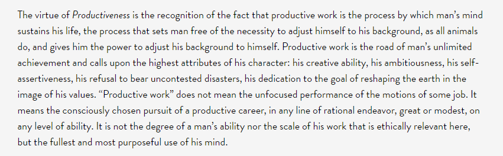
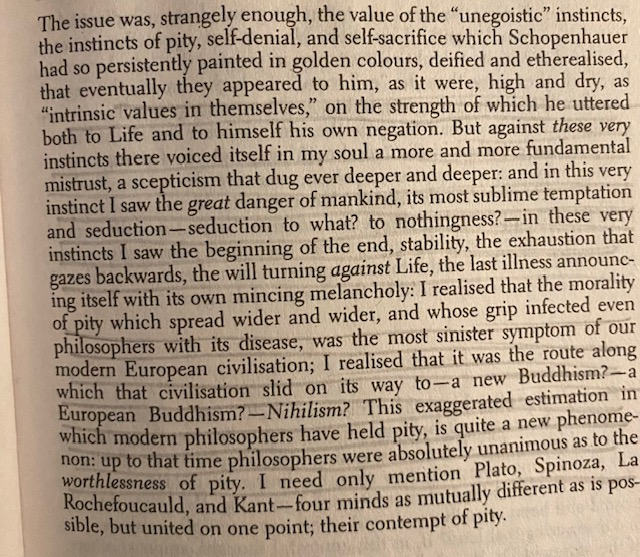
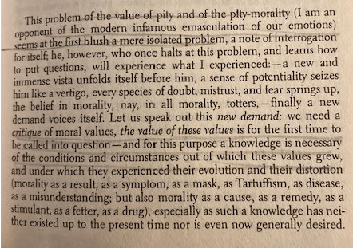
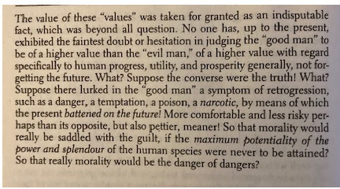

---
output:
  html_document:
    keep_md: true
---

# Week 4 - Egoism, Altruism, and the Social Contract

Instead of the typical LO questions, I want you to play the game that is below. Record your responses, for instance, say what the scenario was (homeless drug addict vs. millionaire etc). After each scenario, there is a blurb that displays below saying the number of people who also made the same or alternate choice as you. Make sure that you also record this in your homework response.

<embed type="text/html" src="https://trolleyproblem.io/" width="800" height="800">

## LOs

* Describe differences between descriptive (psychological) egoism and ethical egoism
* Define altruism, empathy, compassion and love
* Explain criticisms of altruism and the importance of reciprocal altruism
* Explain the challenge posed by the prisoner's dilemma
* Describe how the social contract provides a solution to problems of egoism
* Discuss how egoism is connected to laissez-faire capitalism and economics
* Evaluate the conflict between impartialiaty, egoism, and care
* Defend your own ideas about egoism, altruism, and the social contract

### Empathy, Compassion, and Love

* Descriptive egoism (psychological egoism), people are basically selfish, that they always persue their own goals.

Is competition good? Is it necessary?

If empathy is the psycological capacity to understand what someone else is experiencing, then what does empathy have to do with egoism assuming that empathy is natural? What is compassion and how does it relate to empathy? Compassion builds on empathy, but how does it include the desire to alleviate suffering? Is this desire natural? What is love in light of empathy and compassion? How is it related to either of these concepts? The author defines love as intimacy and attachment. Is empathy devoid of intimacy? Is their empathy or attachment that includes intimacy and that which does not? For instance, is compassion for one's girlfriend different than the compassion one would feel for a stranger?

What about **nepotism** and employment? Do we have obligations to family members? Imagine that we have the choice to hire a stranger or a family member, and lets imagine that their qualifications are the same. Are we committing some moral infraction by hiring the family member?

### The Debate about Egoism and Altruism

## Psychological Egoism

* What Is Psychological Egoism?

* Is Psychological Egoism True?

## Ethical Egoism

* What Is Ethical Egoism?
  * Ethical Egoism argues that it is good for people to pursue their own interests.
  * Altruism breeds dependency and undermines the self-esteem of those who receive benefits and gifts from do-gooder altruists.
* Is Ethical Egoism a Good Theory?

##### Ayn Rand

But do people always act in their own self-interests? When do we exhibit **akrasia**? What is akrasia? "the basic concen is why we fail to do the things we know we ought to do."
* We might feel bad for a car accident victim and want to help, however we might be late for an important job interview and we have been out of work for several years.
* Or, we might not want to help, but do not want to feel burdened by our memory of our failure to help and so we help. Is this akrasia?
  * We might think that we have an obligation to make the job interview on time, but our weakness of well causes us to help the accident victim instead.

What is the **paradox of hedonism**? "The impulse towards pleasure defeats its own aim" [75].

* We have a better chance of obtaining happiness if we do not pursue it.

* Is ethical egoism normative or descriptive?
  * A fact about what we ought to do.

#### Individual vs. Universal ethical egoism

* What is the difference?

People should look after their own interests or I should look after my own self-interests.

Which is **reciprocal altruism** associated with?

* Value of ethical egoism vs. the fact of ethical egoism.

## The Prisoner’s Dilemma

* The Social Contract

* Connections with Economic Theory

## Impartiality, Egoism, and Care

* Care Ethics and the Challenge of Impartiality

* Why Be Moral?

## Chapter Summary

## Primary Source Readings

* Reading 4-1: The Ring of Gyges
* Reading 4-2: Self-Love
* Reading 4-3: Altruism in Nature
* Reading 4-4: Egoism, Altruism, and Care

## Review Exercises

Friedrich Nietzsche offers what many assume to be a criticism of altruism. It is actually one of the more significant criticisms of altruism in philosophical literature. One of the more nuanced and complex arguments.

### First he takes issue with what he calls conflict betweens instinct of self preservation and selfishness, and our more pro-social emotions.

### What happens when we suppress our initial pro-social inclinations?

{width=100%}

{width=100%}
