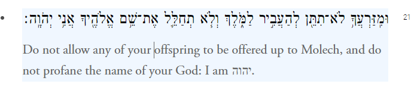
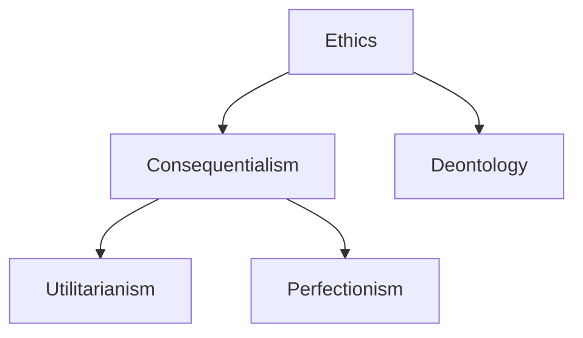
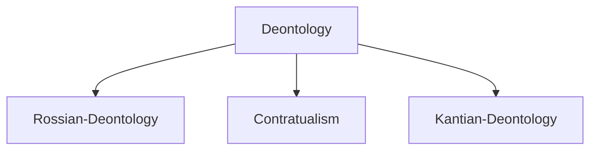

---
output:
  html_document:
    keep_md: true
runtime: shiny_prerendered
---

# Week 6 - Deontological Ethics

## Assignment

This week, once again we are doing something a tad different but also in line with the overall stated goals of the course. Last week we discussed what an argument was.

!!! note "Argument"

    A set of premises followed by a conclusion

We also talked about validity, and soundness.

!!! note "A Valid Argument"

    A set of premises that guarantee a given conclusion

!!! note "A Sound Argument"

    A set of ***true*** premises that guarantee a given conclusion

We talked about some common valid argument forms and invalid ones.

!!! note "Modus Tollens"
    A $\rightarrow$ B 
    $\lnot$ B 
    $\therefore$ A

!!! note "Modus Ponens"

    A $\rightarrow$ B 
    A 
    $\therefore$ B

And we had some fun creating our own examples of each. For instance, we discovered that Socrates was a man.

!!! note "Socrates was a man"

    All men are mortal ***$\therefore$*** 
    (A) Socrates was a man 
    (B) Socrates was mortal 

!!! note "Which Means"
    1. Socrates was a man $\rightarrow$ Socrates was mortal 
    2. Socrates was a man 
    $\therefore$ Socrates was mortal

This week, we will practice deciphering (summarizing) another's argument. In preparation for this, this weeks reading will only be pages 131---141 of *Ethics*[@fial24].

You are then going to summarize this reading using what is called the *4 sentence philosophy paper*.

(1) They say __________, because __________. 
(2) I say __________, because __________. 
(3) One might object that __________. 
(4) I reply that __________ 

These four sentences here are meant to be complete grammatically correct sentences. In otherwords, your job is to fill in the blanks.

This is where the argument forms we used last week can come in handy. What goes in the first blank is the conclusion of the argument. We might say something like: ***Socrates was mortal***. Then ask why the author thinks that Socrates was mortal; ***The author says that Socrates was mortal*** because ***she believes that all men are mortal***.

Then think about whether you agree or disagree. Remember what we said about validity and soundness. These are two ways that you can critize an argument. Either the premises do not support the conclusion, or one or more of them are false. In the example above, you maybe think that not all men are mortal.

* I say that her argument is unsound because dead men are not mortal.

* One might object that dead men are not men.

* I reply that dead men, in virtue of the fact that we can them dead men, must be men who are dead.

This may be more difficult than it looks. The reason why is that your job is to take all of the points Kant makes in the reading, and boil it down to the primary one. What is the one claim he defends? Then look for the one reason he uses to defend that claim.

It will most likely be very helpful for you to read the whole chapter. What this means, is that you are reading a number of pages in order to understand one sentence worth of material. In the long run, spend your time on the reading, it will make writing much less difficult.

## Some Optional Materials

<iframe width="560" height="315" src="https://www.youtube.com/embed/lmhiibdwznQ?si=u1VIo4QQRGjKkFhN" title="YouTube video player" frameborder="0" allow="accelerometer; autoplay; clipboard-write; encrypted-media; gyroscope; picture-in-picture; web-share" referrerpolicy="strict-origin-when-cross-origin" allowfullscreen></iframe>

## Some Important Case Studies

Leviticus 18: 21

> 

and

Genesis 22:2

> 

## Learning Outcomes

##### 6.1 Explain how deontology is a non-consequentialist approach to ethics.

First, consider a highlevel conceptual approach to philosophical questions:

##### 6.2 Describe different deontological approaches to ethics.

##### 6.3 Explain the difference between hypothetical and categorical imperatives.

##### 6.4 Describe two formulations of the categorical imperative.

##### 6.5 Apply Kantian reasoning to a variety of cases in the real world.

##### 6.6 Evaluate the difference between perfect and imperfect duties.

##### 6.7 Defend your own thesis with regard to the value of deontological ethics.

\bibliography
