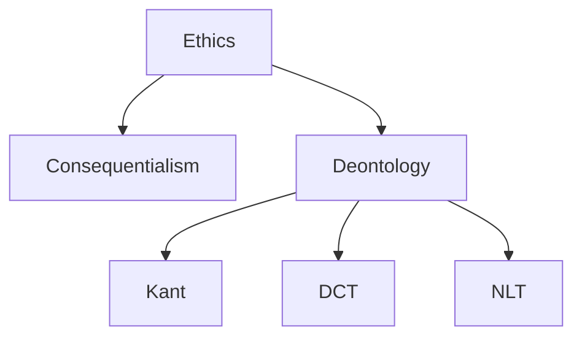

# Week 7 - Natural Law and Human Rights

##### 7.1 Explain how natural law theory is related to the law of peoples and norms of international law.

##### 7.2 Identify the contributions to natural law theory made by key thinkers such as Cicero, Thomas Aquinas, and John Locke.

##### 7.3 Explain the importance of teleology for thinking about natural law.

##### 7.4 Describe how natural law theory is related to the idea of natural rights and the idea of human rights.

##### 7.5 Clarify how natural law arguments are grounded in claims about the essence of human natural that resist relativism.

##### 7.6 Defend your own thesis with regard to the value of natural law theory and the idea of human rights.

## Natural Law and Aquinas

<iframe width="560" height="315" src="https://www.youtube.com/embed/r_UfYY7aWKo?si=K1vuI5jUrYcrvAsA" title="YouTube video player" frameborder="0" allow="accelerometer; autoplay; clipboard-write; encrypted-media; gyroscope; picture-in-picture; web-share" referrerpolicy="strict-origin-when-cross-origin" allowfullscreen></iframe>

## What are some examples of natural laws?

### The Four Features

1. Grounding in Human Nature

* Human Nature in Flourishing == moral law is necessary for human beings to flourish
* Moral law cannot undermine flourishing of human beings

Therefore, an act is right *iff* it promotes human flourishing.

* What are some examples of laws that undermine human flourishing?

2. The Good being Prior to the Right

* Right $\rightarrow$ good

Consider the ***Categorical Imperative:***

> You may perform an act *iff* the principle upon which you are acting is one you can coherently will everyone to act upon.

Imagine borrowing money with the intent of not paying it back. By doing so, you are willing a world wherein no one would lend money, which is inconsistent with your desire to borrow money.

* Good $\rightarrow$ right

> The point is rather that NL theorists believe that our thinking about ethics gets off on the wrong foot if we try to identify principles of right and wrong independently of truths concerning what is good, i.e., what is worth having or seeking. NL theorists regard claims about what is good as the most basic truths concerning the moral life.

Charles Layman, handout <a href="./Natural Law Ethics 12-29-14 copy.pdf" target="_blank"><button class="button">[here]</button></a>

* What do human beings need to flourish? I.e., what is good for humans?
  * life
  * health
  * friendship
  * creative activity
  * knowledge
  * beauty
  * pleasure

The Most Important Moral Truths are Knowable by Us. But what about moral skepticism or moral disagreement? (E.g., non-cognitivism). This is a question about one's capacity and knowledge, or inability to reason moral truths. Such a person merely needs moral education. Therefore moral education is a good.

> However, the prosecution argued successfully that even if the experiments did not violate the defendant's own laws, they were still crimes against humanity. The idea was that there was a law more basic than civil laws exists---a moral law---and these doctors and others should have known what this basic moral law required. [@fial24, 148]

4. The Moral Law is Universal

* Applies to all humans
* Denies moral relativism or moral subjectivism, since accordingly, some moral facts are applicable on the basis of culture etc, or dependent on one's subjective acceptance of that law.

However, NL can still claim that flourishing is relative to one's social or cultural context.

* For instance, restricting one's ability to learn to read in a pre-literate society will not likely have implications for their ability to flourish,

* But preventing it in a literate society will have implications for their flourishing since it can restrict their ability to get a job or support a family.

## Basic Elements of Natural Law

1. Found in Nature and discernible by reason

* Not to be confused with laws of science.

E.g., Natural Law vs. Law of Nature

What are some examples?

Gravity vs. Prohibitions against incest

* Descriptive vs. Prescriptive

The *is* vs. *ought* distinction.

#### How do we determine what is morally right then? {-}

Examine human nature, determine what is essential for us to function well *qua* human.

* Civil vs. Natural Law?

### Aristotle and Aquinas {-}

There are two versions of natural law. Can you guess what these might be? First, they both hold the following:

1. Having genuine needs met
2. Having well-functioning capacities
3. Having well-developed individual talents or abilities

***Aristotle:***

> Nevertheless, it is evident that *eudaimonia*^[One definition can be found in @nuss01i, 6, fn. 2 *eudaimonia* means something like 'living a good life for a human being'; also translated as *human flourishing*] stands in need of good things form outside, as we have said: for it is impossible or difficult to do fine things without resources (Nicomachean Ethics 1099a3 1---3)

For a person to be morally good, the three conditions above will need to be met. However then, it will only be a lucky occurrence if moral goodness is achieved.

Furthermore, our moral goodness should not be relegated to lucky occurrences of nature.

On page 148,

> Unique to persons are the specific capacities of knowing and choosing freely.

What about individuals who because of circumstance, are not able to choose freely? Say for instance because they are slaves, or because of financial constraints, are unable to raise and educate the children they were blessed with and are forced to have an abortion or give them up for adoption.

***Here is Nussbaum again:***

> Each of the human excellences requires some external resources and necessary conditions. Each also requires, more intimately, external objects that will receive the excellent activity. Generosity involves giving to others, who must be there to receive; moderation involves the appropriate relation, in action, to action, to objects (food, drink, sexual partners) who can fail to be present, either altogether or in the appropriate way. [@nuss01i, 343]

Goodness then requires the appropriate personal and political relationships, participation in public affairs and others to receive your excellent activities of love, etc.
